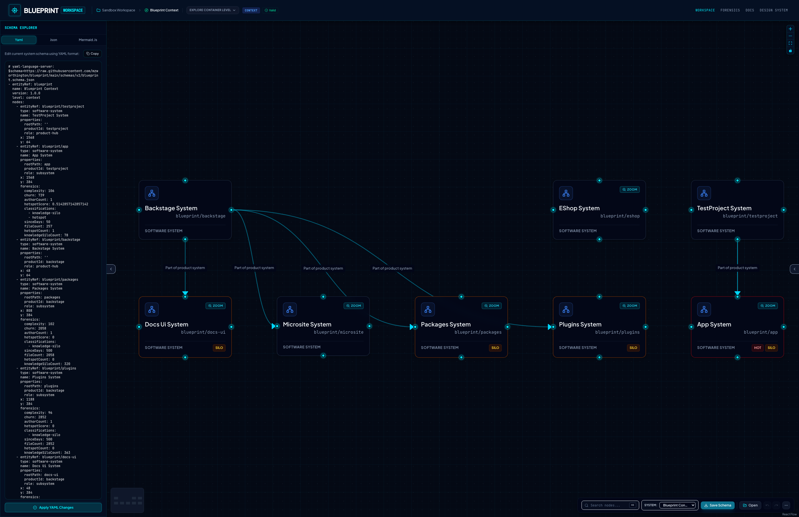

# ArchLens — catch architecture risk before it becomes an outage

[](https://github.com/mzworthington/archlens/actions/workflows/ci.yml) [](https://github.com/mzworthington/archlens/actions/workflows/codeql.yml) [](https://archlens.dev)


ArchLens models systems as **BlueprintSpec** YAML — a living architecture contract you can author locally, publish from CI, and validate with TraceLens, ChaosLens, and AdviceLens while design is still cheap to change.

**Local authoring:** open a folder in ArchLens Canvas, edit diagrams with bi-directional YAML sync, commit when ready — drafts stay on your machine.  
**Published estate:** scan in CI, publish to object storage, and open a shared read-only catalog without redeploying the app.

---

## ArchLens Canvas



A front-end visual canvas web application client. Double-click boundary nodes to drill down into C4 container/component levels and edit schemas side-by-side with code-viewer synchronization.

👉 **Learn more:** [app/packages/designer/README.md](./app/packages/designer/README.md)

---

## ArchLens


A command-line static analysis (AST) codebase scanner. It parses source files, extracts modules, identifies components and dependency references, computes an optimal layout using Dagre, and outputs valid BlueprintSpec YAML inside the `blueprints/` directory.

**Install (macOS / Linux):**

```bash
curl -fsSL https://raw.githubusercontent.com/mzworthington/archlens/main/scripts/install.sh | sh
```

👉 **Learn more:** [app/packages/cli/README.md](./app/packages/cli/README.md) · [Getting started](./docs/guide/getting-started.md)

---

## Workspace Component Catalog

| Component                                                                             | Path                                               | Language/Framework                       | Description                                                      |
| :------------------------------------------------------------------------------------ | :------------------------------------------------- | :--------------------------------------- | :--------------------------------------------------------------- |
| **`@archlens/designer`**                                                              | [app/packages/designer/](./app/packages/designer/) | TypeScript / React / Vite / React Flow   | Front-end visual diagramming client                              |
| **`@archlens/cli`**                                                                   | [app/packages/cli/](./app/packages/cli/)           | TS / Node / Bun / Ts-Morph / Tree-Sitter | Production codebase scanner & Bun binary (`archlens` executable) |
| **`@archlens/core`**                                                                  | [app/packages/core/](./app/packages/core/)         | TypeScript / Zod                         | Shared domain types, validation, entityRef rules (BlueprintSpec) |
| Schema source of truth is TypeScript + Zod in `@archlens/core` (no Protocol Buffers). |

---

## Development & Build Commands

### Visual frontend & packages (`/app`)

```bash
cd app

pnpm install
pnpm dev                 # docs at / + canvas at /workspace
pnpm build
pnpm lint
pnpm format:check
pnpm test                # all workspace packages
pnpm test:designer
pnpm test:cli
pnpm test:e2e
```

### TypeScript CLI (`/app/packages/cli`)

```bash
cd app

pnpm dev:cli
pnpm dev:cli --headless --glob="packages/**/*.ts" --output="blueprints"
pnpm --filter @archlens/cli build
pnpm test:cli
```

---

## Deep-dive documentation

Product guide and reference live as Markdown under [`docs/`](./docs/) (same files locally, in git, and on the site):

- **[Product guide](./docs/guide/index.md)** - overview, ArchLens Canvas, ArchLens, TraceLens, ChaosLens
- **[E2E Journeys & Interface Tour](./docs/journeys.md)**
- **[Unit test features](./docs/features-unit.md)** - generated Vitest feature report (`pnpm generate:features-unit`)
- **[System Architecture & Security](./docs/architecture.md)**
- **[Setup & Local Development](./docs/setup.md)**

```bash
cd app
pnpm dev   # docs (/) + workspace (/workspace) in one Vite app
```

Live site: [archlens.dev](https://archlens.dev) - documentation at `/`, canvas at `/workspace`.
