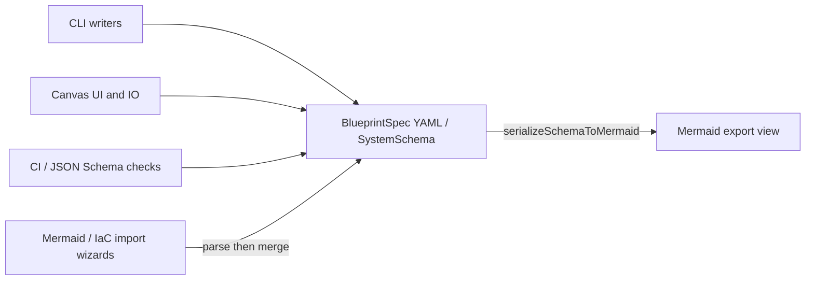

# 0001. YAML BlueprintSpec as the sole editable source of truth

## Context and Problem Statement

ArchLens products (CLI, Canvas, CI) must share one editable architecture contract. Diagram syntaxes such as Mermaid are useful for display and import, but they omit BlueprintSpec fields (`entityRef`, forensics, resilience, Zod-validated node types). We must decide which format is the sole editable source of truth so adapters do not invent competing stores or round-trip editors.

## Decision Drivers

- Hard to reverse: persistence shape and public BlueprintSpec / JSON Schema contract
- Cross-cutting: CLI writers, canvas IO, CI schema checks, and external integrators
- Boundary clarity: pure domain in `@archlens/core`; Mermaid as derive/import only
- Diffability and hand-editability in git

## Considered Options

- Option A — YAML BlueprintSpec (`SystemSchema`) as sole editable canonical store; Mermaid and other views are derived exports (status quo)
- Option B — Mermaid as primary store; reconstruct richer fields on load
- Option C — Dual-write YAML and Mermaid as peer sources of truth
- Option D — Protobuf / binary wire format as the on-disk contract

## Decision Outcome

Chosen option: "**Option A**", because BlueprintSpec YAML already is the shared Zod contract in `@archlens/core`, is human-diffable, and carries identity and product fields Mermaid cannot round-trip. Mermaid export (`serializeSchemaToMermaid`) and import wizards that parse into `SystemSchema` remain adapters—not peer editors of the persisted model.

### Consequences

- Good, because CLI, Canvas, and CI share one YAML/`SystemSchema` contract and public JSON Schema URLs
- Good, because export-only views (e.g. Code Viewer Mermaid) stay non-editable; imports merge via conflict preview
- Bad, because Mermaid-first users must go through an import wizard rather than editing Mermaid in place
- Follow-up: see ADR-0002 (entityRef), ADR-0006 (import merge), ADR-0007 (shared core)

## Architecture sketch

## Links

- Related ADRs: [0002](./0002-entityref-hierarchical-diagram-identity.md), [0006](./0006-import-as-merge-into-active-diagram.md), [0007](./0007-shared-archlens-core-as-published-language.md)
- Spec / docs: [BlueprintSpec guide](../guide/schema.md), [System architecture](../architecture.md), [AGENTS.md](../../AGENTS.md), [`@archlens/core` README](../../app/packages/core/README.md)
- Arch norms: hexagonal, DDD, vertical slices (kit `CODING_PHILOSOPHY.md`); domain types in `app/packages/core/src/models/schema.ts`
