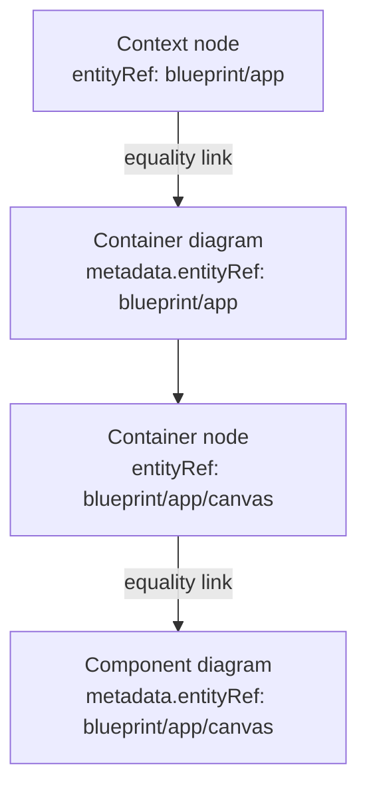

# 0002. Hierarchical entityRef as diagram and node identity

## Context and Problem Statement

BlueprintSpec YAML diagrams and nodes need a stable, portable identity so drill-down, cross-file dependencies, merges and TraceLens rollups stay meaningful across tools. We must decide how parent/child C4 diagrams link and what serves as the integration ID - without inventing a separate parent-pointer mechanism or coupling identity to filesystem layout.

## Decision Drivers

- Hard to reverse: identity is a public integration contract for YAML, CLI, Canvas and consumers
- Cross-cutting: same refs drive hierarchy, dependencies, breadcrumbs and merge conflict keys
- Boundary clarity: domain FQNs live in `@archlens/core`, not file paths or adapter-local IDs
- Operability: hand-authored and generated blueprints must link without a workspace manifest

## Considered Options

- Option A - Hierarchical entityRef equality linking (status quo): slash-segment FQNs; child `metadata.entityRef` equals parent node `entityRef`; segment count maps to C4 level
- Option B - Explicit `parentRef` / foreign keys in YAML
- Option C - File-path-based identity
- Option D - Opaque UUIDs + separate link table

## Decision Outcome

Chosen option: "**Option A**", because it is already the documented BlueprintSpec contract and core resolution model: `entityRef` is the integration ID; hierarchy is equality of child diagram ref to parent node ref; C4 depth is encoded in segment count. Options B-D add schema surface, path coupling or indirection without improving merge or drill-down clarity.

### Consequences

- Good, because drill-down, FQN resolution and breadcrumbs share one hierarchical string model in core
- Good, because integrators need no parent-pointer file or link registry
- Bad, because renaming a ref is a breaking identity change across files and tools
- Bad, because segment-count → C4 level is conventional; misuse of depth confuses level inference
- Follow-up: keep display `name` independent of refs; treat committed refs as stable integration IDs

## Architecture sketch

Chosen shape: context node → container diagram → component diagram via matching `entityRef`.

## Links

- Related ADRs: [ADR-0001](./0001-yaml-blueprintspec-as-canonical-format.md)
- Spec / issue: [BlueprintSpec / entityRef guide](../guide/schema.md); core [`entityIdentity.ts`](../../app/packages/core/src/models/entityIdentity.ts), [`entityRef.ts`](../../app/packages/core/src/lib/entityRef.ts), [`schema.ts`](../../app/packages/core/src/models/schema.ts); [architecture.md](../architecture.md)
- Arch norms: hexagonal, DDD, vertical slices (kit `CODING_PHILOSOPHY.md`)
