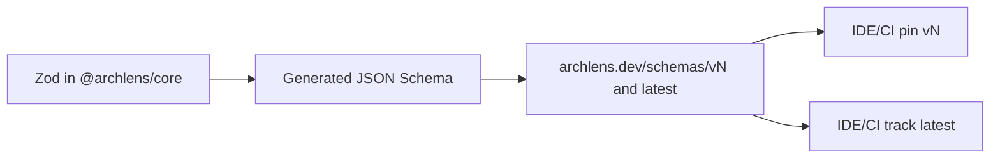

# 0003. Public JSON Schema major-version channels

## Context and Problem Statement

BlueprintSpec and ChaosSpec YAML are shared contracts for Canvas, CLI, IDEs and external CI. Consumers need a stable, fetchable validation surface without running ArchLens. We must decide how schema identity is published and what the in-file `version` field carries so pins and upgrades stay predictable.

## Decision Drivers

- Hard to reverse: published URLs and YAML `version` values become external contracts
- Cross-cutting: core Zod, checked-in `schemas/`, GitHub Pages, IDE directives and integrators
- Single source of truth in `@archlens/core` (hexagonal domain; no parallel IDL)
- Operability: pin vs track-latest without semver churn for additive changes

## Considered Options

- Option A - URL-in-`version` + public `v{N}` / `latest` channels at `archlens.dev/schemas/…`
- Option B - Semver-only in-file `version` (legacy pre-v3 strings)
- Option C - Private/unpublished schema (validate only inside ArchLens)
- Option D - Separate OpenAPI/Protobuf registry alongside Zod

## Decision Outcome

Chosen option: "**Option A**", because Zod in `@archlens/core` remains the sole contract; generated JSON Schema is published at `archlens.dev/schemas/v{N}` and `latest`; YAML `version` holds that public schema URL; major bumps only for breaking changes. Matches status quo (`schemaVersion.ts`, `chaosVersion.ts`, guide/schema docs).

### Consequences

- Good, because IDEs/CI can validate without the app; pins use `v{N}`, movers use `latest`
- Good, because domain stays in core Zod; JSON Schema is a derived adapter artifact
- Bad, because URL-shaped `version` couples files to hosting layout; legacy semver needs migration assessment
- Follow-up: keep generating `schemas/v{n}/` and `schemas/latest/` from core; bump major only on breaks

## Architecture sketch

## Links

- Related ADRs: [ADR-0001](./0001-yaml-blueprintspec-as-canonical-format.md)
- Spec / docs: [BlueprintSpec guide](../guide/schema.md), [ChaosSpec guide](../guide/chaos-spec.md), [`@archlens/core` README](../../app/packages/core/README.md), [architecture.md](../architecture.md)
- Arch norms: hexagonal, DDD, vertical slices (kit `CODING_PHILOSOPHY.md`)
