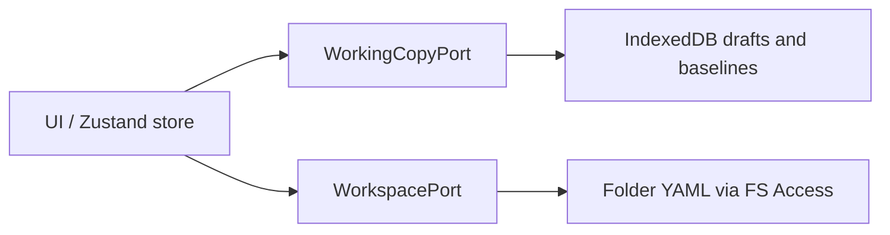

# 0004. Local-first FS Access and IndexedDB working copy

## Context and Problem Statement

ArchLens Canvas must open and edit BlueprintSpec YAML without a backend workspace service. Edits need a durable draft layer, a clear path to disk, and boundaries that stay hexagonal. How should persistence work: browser FS Access + local drafts, a sync server, in-place disk edits, or ZIP round-trips?

## Decision Drivers

- Hard to reverse: persistence shape and commit semantics couple IO, UI, and ports
- Off-norm: no app server / SaaS workspace sync (deliberate vs typical hosted products)
- Cross-cutting: WorkspacePort, WorkingCopyPort, DiffMenu, and store IO share one model
- Offline / privacy: blueprints stay on the user's machine unless they commit to a folder

## Considered Options

- Option A — File System Access (or bundled demos) + IndexedDB working copy + DiffMenu commit/revert
- Option B — Server-backed workspace sync
- Option C — Edit disk YAML in place with no draft layer
- Option D — Download/upload ZIP only

## Decision Outcome

Chosen option: "**Option A**", because it matches the status-quo local-first Canvas: open a folder or sandbox, persist drafts/baselines via `WorkingCopyPort` (IndexedDB), and write disk YAML only through DiffMenu commit (revert restores baseline). No server workspace.

### Consequences

- Good, because drafts are explicit, commit is user-gated, and demos work without a folder
- Bad, because this deliberately differs from typical SaaS persistence (no multi-device sync, no server ACL)
- Mitigation: outbound ports (`WorkingCopyPort`, `FileSystemPort` / `WorkspacePort`) keep adapters swappable if sync or other backends are added later
- Bad, because browser FS Access support and permission UX constrain the open-folder path

## Architecture sketch

## Links

- Related ADRs: [ADR-0001](./0001-yaml-blueprintspec-as-canonical-format.md), [ADR-0006](./0006-import-as-merge-into-active-diagram.md)
- Spec / docs: [architecture.md](../architecture.md), [canvas guide](../guide/canvas.md); ports in `app/packages/canvas/src/core/models/ports.ts`
- Arch norms: hexagonal, DDD, vertical slices (kit `CODING_PHILOSOPHY.md`)
