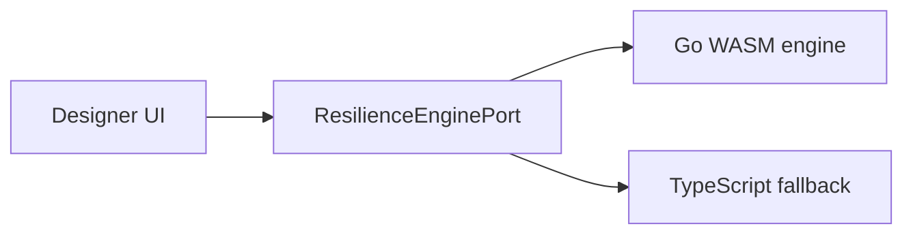

# 0005. Go WASM ChaosLens with TypeScript fallback

## Context and Problem Statement

ChaosLens must run heavy Monte Carlo blast-radius simulation in the browser and as a headless CLI, while the kit norm is TypeScript-first domain logic. Pure TypeScript hits event-loop and GC limits on large graphs; a second language needs a lasting boundary. Which engine is primary, and how do designer and core stay decoupled from the implementation language?

## Decision Drivers

- Performance and portability for Monte Carlo (browser WASM + headless CLI, same core)
- Hexagonal boundary clarity (`ResilienceEnginePort`, shared JSON/types)
- Operability when WASM is missing (deterministic fallback)
- Deliberate exception to kit TypeScript-first norms must stay contained

## Considered Options

- Option A — Go WASM primary + TypeScript deterministic fallback behind `ResilienceEnginePort` (status quo)
- Option B — TypeScript-only simulation
- Option C — Rust WASM instead of Go
- Option D — Remote simulation service

## Decision Outcome

Chosen option: "**Option A**", because the Go engine already ships as WASM (`chaoslens.wasm`) and CLI from `resilience-engine/`, matching PLAN performance and CI portability goals, while `@archlens/core/resilience` keeps the shared `WasmSimulationRequest` / result contract and a deterministic TypeScript path when WASM is unavailable. Option B forgoes Monte Carlo scale and shared CLI reuse. Option C would redo a working Go stack without a clear win. Option D adds network, auth, and latency coupling for a local studio feature.

### Consequences

- Good, because one Go sim core serves browser and CLI; designer talks only to `ResilienceEnginePort`.
- Bad, because this is a deliberate polyglot exception to kit TypeScript-first norms (extra toolchain, WASM artifacts, dual engine paths).
- Mitigations: port boundary (`ResilienceEnginePort`); shared JSON/types in `@archlens/core/resilience` (`wasmTypes`, simulation result shape); TypeScript fallback via `runResilienceSimulation` when WASM fails or is absent.

## Architecture sketch

## Links

- Related ADRs: [ADR-0007](./0007-shared-archlens-core-as-published-language.md)
- Spec / docs: [PLAN.md](../../PLAN.md), [chaoslens-engine.md](../chaoslens-engine.md), [architecture.md](../architecture.md)
- Arch norms: hexagonal, DDD, vertical slices (kit `CODING_PHILOSOPHY.md`); deliberate polyglot exception documented above
