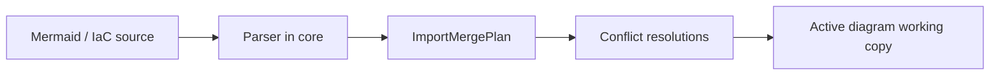

# 0006. Import external diagrams as merge into the active diagram

## Context and Problem Statement

External Mermaid and IaC must enter ArchLens without corrupting the canonical YAML `SystemSchema` (BlueprintSpec) or the user's working copy. We need a lasting rule for how parsed imports relate to the active diagram: merge with conflict preview, wholesale replace, bidirectional Mermaid edit or separate unlinked diagrams.

## Decision Drivers

- Hard to reverse: import UX and merge semantics couple core parsers, canvas wizards and draft/commit flow
- Cross-cutting: `@archlens/core` merge plan + canvas import adapters + canvas commit path
- Preserve populated workspaces: do not clobber hand-edited topology or enrichment
- Canonical format stays YAML `SystemSchema`; Mermaid remains a derived export ([AGENTS.md](../../AGENTS.md))

## Considered Options

- Option A - Parse → `ImportMergePlan` → conflict UI → apply approved resolutions as drafts into the active diagram (status quo)
- Option B - Replace the active schema wholesale with the imported schema
- Option C - Bidirectional Mermaid editing (Code Viewer tab editable with round-trip)
- Option D - Import only as separate unlinked diagrams

## Decision Outcome

Chosen option: "**Option A**", because parsers and merge logic stay in core (`mermaidImport`, `schemaMerge`), the Canvas package only previews conflicts and applies user resolutions into the working copy and disk writes still go through DiffMenu commit. Wholesale replace (B) loses populated-workspace work; bidirectional Mermaid (C) fights the YAML canonical model and lossy Mermaid export; unlinked diagrams (D) break `entityRef`-linked navigation.

### Consequences

- Good, because conflicts are explicit (`skip` / `rename` / `overwrite`) and enrichment (layout, forensics) can survive overwrite
- Good, because Mermaid Code Viewer stays export-only; import wizards are the sole ingress
- Bad, because import is lossy for Mermaid/IaC-only properties and requires user conflict review on dense diagrams
- Follow-up: keep new import formats on the same plan → preview → draft path

## Architecture sketch

## Links

- Related ADRs: [ADR-0001](./0001-yaml-blueprintspec-as-canonical-format.md), [ADR-0004](./0004-local-first-fs-access-and-indexeddb-working-copy.md)
- Spec / docs: [canvas guide](../guide/canvas.md); `schemaMerge.ts`, `mermaidImport.ts`, `diagramImportShared.ts`
- Arch norms: hexagonal, DDD, vertical slices (kit `CODING_PHILOSOPHY.md`)
