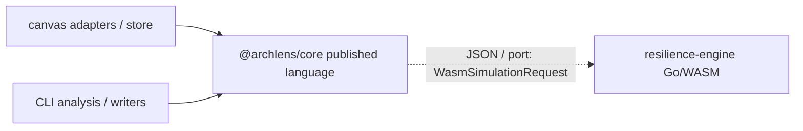

# 0007. Shared `@archlens/core` as published language between Canvas and CLI

## Context and Problem Statement

Canvas and CLI must agree on BlueprintSpec (`SystemSchema`), Zod validation, merge/import rules, resilience types, and forensics helpers without drifting. We need a durable shared contract: where does that published language live, and what stays out of it (I/O, UI, FS, AST parsers)?

## Decision Drivers

- Hard-to-reverse package API boundary (cross-cutting across Canvas and CLI)
- Hexagonal + DDD: pure domain inward; adapters at edges
- One Zod/YAML contract for validate, import, and canvas (operability)
- Avoid model duplication and independent version skew

## Considered Options

- Option A - Shared `@archlens/core` monorepo package (status quo): schema types, Zod, merge, Mermaid/IaC import, resilience types, forensics helpers; no I/O
- Option B - Duplicate models per app (Canvas vs CLI each own types/validation)
- Option C - Separate versioned npm publish with independent semver
- Option D - Codegen from external IDL (Protobuf/OpenAPI) into each package

## Decision Outcome

Chosen option: "**Option A**", because a single private monorepo package is already the published language: Canvas and CLI import the same pure domain; UI/FS/parsers stay in adapters. Aligns with hexagonal + DDD kit norms and with evidence in `docs/architecture.md` and `@archlens/core` README/exports.

### Consequences

- Good, because one Zod/`SystemSchema` contract; TDD and import/merge logic live in core; edges stay thin
- Bad, because core API changes ripple to both apps in the same PR (intentional coupling)
- Follow-up: keep I/O and language AST parsers out of core; resilience-engine stays behind JSON/port contract (`@archlens/core/resilience` request/result shapes)

## Architecture sketch

Context map of the chosen published language.

## Links

- Related ADRs: [ADR-0001](./0001-yaml-blueprintspec-as-canonical-format.md), [ADR-0003](./0003-public-json-schema-major-version-channels.md), [ADR-0005](./0005-go-wasm-chaoslens-with-typescript-fallback.md)
- Spec / docs: [`@archlens/core`](../../app/packages/core/README.md), [architecture.md](../architecture.md), [AGENTS.md](../../AGENTS.md)
- Arch norms: hexagonal, DDD, vertical slices (kit `CODING_PHILOSOPHY.md`); TDD mandate for core parsers/merge in `AGENTS.md`
