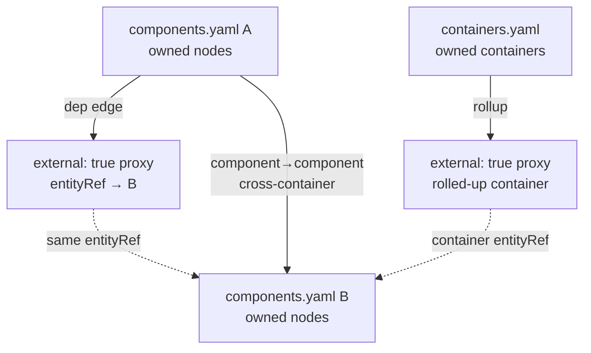

# 0008. Workspace external proxy nodes for cross-diagram endpoints

## Context and Problem Statement

BlueprintSpec keeps one YAML schema per C4 view (context / container / component). Cross-diagram and unresolved dependency endpoints still need a canvas presence for wiring, enrichment, rollup and ChaosLens. We must decide how those foreign endpoints appear without collapsing the multi-file workspace model.

## Decision Drivers

- Hard to reverse: `SystemNode.external` and persisted proxy nodes shape YAML, CLI enrich and canvas
- Cross-cutting: `workspaceExternals`, CLI externals pass, canvas merge/display, container rollup
- Preserve per-diagram ownership via `entityRef` (ADR-0001 / ADR-0002) without inlining foreign graphs
- Operability: idempotent enrich, dashed-border proxies, Show Externals, container rollup

## Considered Options

- Option A - External proxy nodes (`external: true`) + workspace enrichment / container rollup (status quo)
- Option B - Fully dereference/inline foreign nodes into each YAML file
- Option C - Edges only (no proxy nodes on canvas)
- Option D - Single mega-graph file for the estate

## Decision Outcome

Chosen option: "**Option A**", because each schema stays the source of truth for its level while cross-diagram endpoints materialize as lightweight `external: true` proxies sharing canonical `entityRef`s. CLI `enrich` / Canvass’ workspaceExternals pass and container rollup keep couplings visible without copying foreign graphs (B), dropping canvas endpoints (C) or abandoning multi-file C4 files (D).

### Consequences

- Good, because diagrams stay small, proxies are idempotent and rollup synthesizes container-level edges from component evidence
- Good, because canvas/ChaosLens can wire to unresolved or foreign endpoints with dashed-border proxies
- Bad, because proxies can drift if enrich is skipped after hand edits; callers must re-run the externals pass
- Follow-up: keep enrichment in `@archlens/core` (`workspaceExternals/`); UI only surfaces candidates and display toggles

## Architecture sketch

Component and container schemas stay separate; proxies link by `entityRef`, with rollup lifting cross-container component deps.

## Links

- Related ADRs: [ADR-0001](./0001-yaml-blueprintspec-as-canonical-format.md), [ADR-0002](./0002-entityref-hierarchical-diagram-identity.md)
- Spec / docs: [canvas guide](../guide/canvas.md), [architecture.md](../architecture.md), [CLI README](../../app/packages/cli/README.md), `SystemNode.external` in `app/packages/core/src/models/schema.ts`
- Arch norms: hexagonal, DDD, vertical slices (kit `CODING_PHILOSOPHY.md`)
