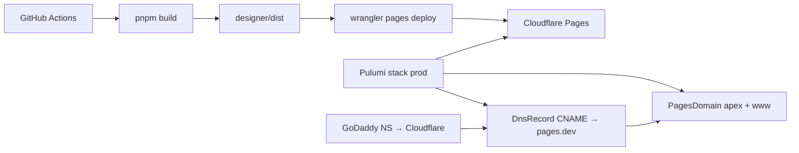

# 0009. Cloudflare Pages static hosting with Pulumi and Wrangler

## Context and Problem Statement

ArchLens production (docs + designer SPA, JSON Schema hosting, PWA) was deployed to GitHub Pages at `archlens.dev`. We need a code-first hosting stack with better CDN control, simpler SPA routing, and infrastructure defined in the repository rather than dashboard clicks.

## Decision Drivers

- Operability: deploy and DNS reproducible from git
- SPA routing: `/schemas/*` must serve JSON, not the HTML shell
- Minimal moving parts: keep existing `pnpm build` pipeline
- State management: remote, encrypted state (Pulumi Cloud)

## Considered Options

- Option A — GitHub Pages + `404.html` SPA hack (status quo)
- Option B — Cloudflare Pages with dashboard Git integration
- Option C — Cloudflare Pages: Pulumi for project/domains, GitHub Actions + Wrangler for static upload
- Option D — Terraform instead of Pulumi for Cloudflare resources

## Decision Outcome

Chosen option: "**Option C**", with Pulumi over Terraform because the maintainer prefers Pulumi for IaC. Pulumi manages the Pages project, custom domains, and apex/`www` DNS (proxied CNAMEs to the Pages subdomain); CI builds `app/packages/designer/dist` and runs `wrangler pages deploy`. SPA fallback uses `public/_redirects` instead of GitHub Pages redirect scripts.

### Consequences

- Good, because deploy path stays in existing GitHub Actions quality gates (unit, e2e, then deploy)
- Good, because `_redirects` replaces fragile `404.html` / query-string SPA hacks
- Bad, because GoDaddy nameserver change remains a one-time manual registrar step
- Follow-up: disable GitHub Pages in repo settings after cutover

## Architecture sketch

## Links

- Secrets checklist: [docs/cloudflare-secrets.md](../cloudflare-secrets.md)
- Infra: [infra/cloudflare/README.md](../../infra/cloudflare/README.md)
- Supersedes: GitHub Pages deploy job in `.github/workflows/ci.yml`
