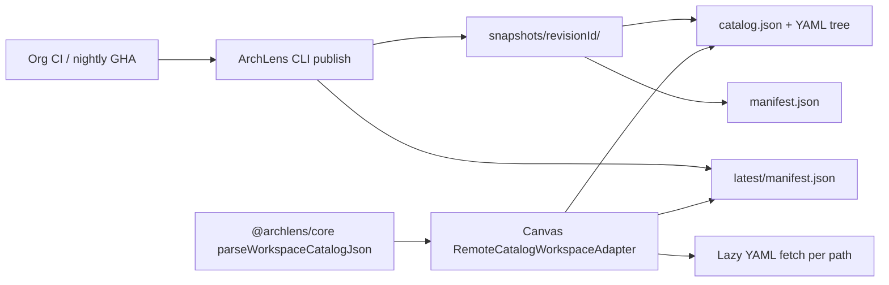

# 0010. Remote blueprint catalog contract (manifest + catalog.json + YAML)

## Context and Problem Statement

Organisations want **living architecture** diagrams: CI runs ArchLens on a schedule, publishes YAML to object storage, and Canvas opens diagrams from that remote corpus without redeploying the SPA. CLI and Canvas are separate processes with no shared database. We need a **stable, versioned integration contract** that publish pipelines and read adapters can implement independently.

Today the dogfood sandbox uses build-time bundled YAML under `/bundled-blueprints/` plus a generated `catalog.json`. Remote publish must preserve the same navigation semantics (`WorkspaceCatalogEntry[]`, lazy YAML fetch by path) while supporting immutable snapshots and safe partial-failure handling during upload.

## Decision Drivers

- Hard to reverse: public object layout and manifest fields become the customer integration surface
- Cross-cutting: CLI publish, core catalog builder, and designer `WorkspacePort` adapters all depend on the same shape
- Reliability: a failed or partial upload must not leave consumers pointing at missing objects
- Compatibility: reuse `buildWorkspaceCatalogFromYamlFiles` / `parseWorkspaceCatalogJson` from `@archlens/core`
- Security (read path): contract assumes **read-only** consumption in Canvas; credentials stay in CI (slice 1) or connection profiles (slice 2, ADR-0013)

## Considered Options

- Option A — Flat bucket root: overwrite `catalog.json` and YAML in place on each publish
- Option B — Immutable snapshot prefix + `latest` pointer manifest (recommended)
- Option C — Git LFS or tarball artifact only; Canvas downloads and unpacks entire corpus
- Option D — New catalog schema (protobuf/GraphQL) instead of existing `catalog.json`

## Decision Outcome

Chosen option: "**Option B**" — each successful publish writes an **immutable snapshot** under a revision-specific prefix; a small **`latest/` pointer** (updated last) tells consumers which snapshot is current.

### Snapshot layout

All paths are relative to a **catalog base URL** (bucket prefix or CDN origin). Example base: `https://{host}/blueprints/`.

```
blueprints/
  latest/
    manifest.json          # pointer only; written last
  snapshots/
    {revisionId}/
      manifest.json        # full snapshot metadata
      catalog.json         # WorkspaceCatalogEntry[]
      {diagramPath}.yaml   # paths match catalog entry `path` fields
```

**`snapshots/{revisionId}/manifest.json`** (required):

| Field           | Type   | Description                                                                                      |
| --------------- | ------ | ------------------------------------------------------------------------------------------------ |
| `revision`      | string | Unique id for this snapshot (content hash prefix or ULID). Same as `{revisionId}` in the prefix. |
| `publishedAt`   | string | ISO-8601 UTC timestamp                                                                           |
| `toolVersion`   | string | ArchLens CLI version that produced the corpus                                                    |
| `workspaceName` | string | Workspace name used for entityRef resolution (dogfood: `archlens`)                               |
| `catalogPath`   | string | Relative path to catalog within the snapshot (always `catalog.json`)                             |
| `objectCount`   | number | Count of YAML objects uploaded (sanity check)                                                    |

Optional later: `objects[]` with per-file SHA-256 for integrity verification (not required for slice 1).

**`latest/manifest.json`** (required at base URL):

| Field            | Type   | Description                                     |
| ---------------- | ------ | ----------------------------------------------- |
| `revision`       | string | Points to `snapshots/{revisionId}/`             |
| `publishedAt`    | string | Copied from the snapshot manifest               |
| `snapshotPrefix` | string | Relative prefix, e.g. `snapshots/{revisionId}/` |

Consumers resolve catalog URL as: `{base}{snapshotPrefix}catalog.json` after reading `latest/manifest.json`. For a pinned revision, skip `latest/` and use `snapshots/{revisionId}/` directly.

**`catalog.json`**: unchanged — JSON array validated by `parseWorkspaceCatalogJson` in `@archlens/core`. Each entry's `path` is relative to the snapshot root (e.g. `app/containers.yaml`).

**YAML files**: valid BlueprintSpec (`SystemSchema`) documents at paths referenced by the catalog. No HTML shell, no SPA fallback on these paths (hosting is ADR-0009 / storage CORS concern, ADR-0011).

### Publish protocol (CLI / CI)

1. Run analysis and `archlens validate`; **abort publish** on validation failure.
2. Compute `revisionId` (recommended: hash of sorted file contents or build id + git sha).
3. Upload all YAML and `catalog.json` under `snapshots/{revisionId}/`.
4. Write `snapshots/{revisionId}/manifest.json`.
5. **Atomically switch** `latest/manifest.json` (single-object overwrite after step 4 completes).

Steps 3–4 must finish before step 5 so `latest` never references a partial snapshot.

### Consume protocol (Canvas adapter)

1. `GET {base}latest/manifest.json` → read `snapshotPrefix`.
2. `GET {base}{snapshotPrefix}catalog.json` → `parseWorkspaceCatalogJson`.
3. On diagram open, `GET {base}{snapshotPrefix}{entry.path}` (lazy, same as bundled sandbox today).
4. Optional refresh (slice 1b): compare cached `revision` with a new `latest/manifest.json`; prompt before reload.

### Consequences

- Good, because CLI and Canvas integrate through a documented, testable contract without shared state
- Good, because immutable snapshots support rollback, forensics, and "pin to revision" for audits
- Good, because `catalog.json` and `WorkspaceCatalogEntry` reuse avoids a second navigation model
- Bad, because storage hosts must serve static JSON/YAML with correct `Content-Type` and CORS (adapter concern, ADR-0011)
- Bad, because `latest/` overwrite is eventually consistent on some stores — consumers should retry on 404 immediately after publish
- Follow-up: ADR-0011 (object storage / R2 dogfood), ADR-0012 (remote read-only `WorkspacePort` adapter), ADR-0013 (practitioner connection profiles / auth)
- Implementation: `@archlens/storage` (`ObjectStoragePort` + R2/S3/Azure/HTTP adapters)
- Open (slice 1): retain bundled `/bundled-blueprints/` as offline fallback until remote path is stable for 7 consecutive nightly publishes

## Architecture sketch



## Links

- PRD: [docs/remote-blueprint-catalog-prd.md](../remote-blueprint-catalog-prd.md)
- Contract tests: `app/packages/core/src/lib/remoteCatalogSnapshot.test.ts`
- Related ADRs: [ADR-0004](./0004-local-first-fs-access-and-indexeddb-working-copy.md), [ADR-0007](./0007-shared-archlens-core-as-published-language.md), [ADR-0009](./0009-cloudflare-pages-static-hosting.md)
- Core types: `WorkspaceCatalogEntry`, `parseWorkspaceCatalogJson`, `buildWorkspaceCatalogFromYamlFiles`
