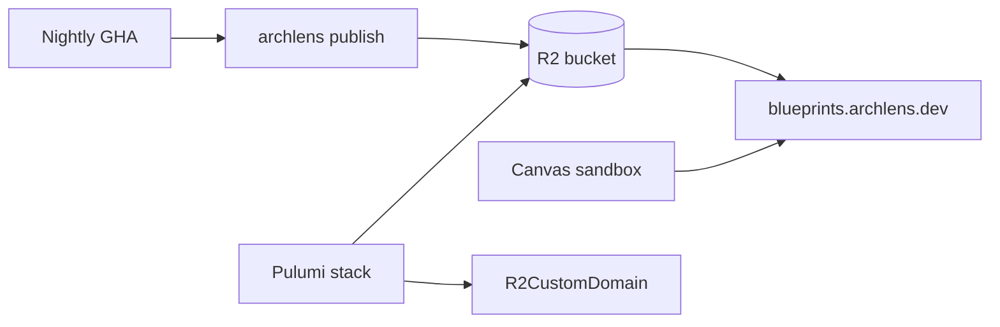

# 0011. Object storage for published blueprint corpora (R2 hosted catalog)

## Context and Problem Statement

ADR-0010 defines the remote catalog contract. ArchLens needs a **hosted object store** for nightly publishes from CI and **browser read access** for the sandbox on `archlens.dev`. Customer integrations (slice 2) should reuse the same S3-compatible port without locking to one vendor.

## Decision Drivers

- Operability: same Cloudflare account as Pages/DNS (ADR-0009)
- Security: write credentials stay in CI; SPA only needs public GET
- Performance: ~1.5k objects / ~20MB corpus; lazy fetch per diagram
- Portability: S3-compatible API for future customer buckets (AWS S3, MinIO, Azure via S3 gateway)

## Considered Options

- Option A — Keep full corpus bundled in Pages deploy (status quo)
- Option B — Cloudflare R2 + custom domain `blueprints.archlens.dev` (hosted catalog)
- Option C — Pages-only path (`/bundled-blueprints/`) with separate nightly Pages redeploy
- Option D — GitHub Releases tarball consumed by Canvas

## Decision Outcome

Chosen option: "**Option B**" — dedicated R2 bucket `archlens-blueprint-catalog` with:

- **Pulumi:** `R2Bucket`, `R2BucketCors` (GET/HEAD from `archlens.dev` + local dev), `R2CustomDomain` on `blueprints.archlens.dev`
- **CI publish:** `archlens publish --no-dry-run` via S3 API (`@aws-sdk/client-s3`, endpoint `https://{accountId}.r2.cloudflarestorage.com`)
- **Secrets:** `R2_BLUEPRINT_CATALOG_*` in GitHub Actions (scoped Object Read & Write on the bucket only)

Hosted catalog base URL (historical bucket root): `https://blueprints.archlens.dev/`.

**Samples estate (ADR-0014):** concurrent publishers stage **fragments** under one prefix and compose. Canvas production builds use `VITE_REMOTE_CATALOG_BASE_URL=https://blueprints.archlens.dev/estates/samples/`. Under that prefix the ADR-0010 layout (`latest/`, `snapshots/{revisionId}/`) is unchanged.

| Fragment product | Workflow                              |
| ---------------- | ------------------------------------- |
| `samples`        | `publish-samples.yml`                 |
| `archlens`       | `publish-blueprint-catalog.yml`       |
| `{id}`           | `publish-demo-catalog.yml` matrix leg |

Compose-before-publish (fragments → one estate `latest`) is [ADR-0014](./0014-estate-fragments-and-compose-before-publish.md).

### Consequences

- Good, because catalog updates decouple from SPA deploys
- Good, because R2 S3 API is portable to customer storage adapters later
- Good, because custom domain keeps CORS and caching under our zone
- Bad, because R2 API tokens are a manual bootstrap step (dashboard → bws → GitHub)
- Bad, because first publish must succeed before production sandbox can load remotely
- Follow-up: ADR-0012 (Canvas adapter); ADR-0014 (estate fragments); retain bundled `/bundled-blueprints/` as dev/PR fallback until remote is stable

## Architecture sketch

## Links

- [ADR-0010](./0010-remote-blueprint-catalog-contract.md)
- [ADR-0012](./0012-remote-read-only-workspace-port.md)
- [ADR-0014](./0014-estate-fragments-and-compose-before-publish.md)
- Infra: [infra/cloudflare/README.md](../../infra/cloudflare/README.md)
- Secrets: [docs/cloudflare-secrets.md](../cloudflare-secrets.md)
