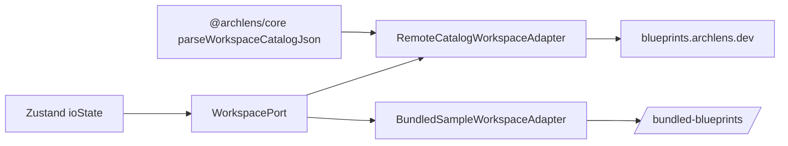

# 0012. Remote read-only WorkspacePort adapter for the hosted sandbox

## Context and Problem Statement

The dogfood sandbox today uses `BundledSampleWorkspaceAdapter`, which fetches `/bundled-blueprints/catalog.json` and YAML from the Pages origin. ADR-0011 moves the corpus to R2. Canvas still loads diagrams through `WorkspacePort` (ADR-0004); we need a **read-only remote adapter** that follows ADR-0010 consume protocol without breaking folder workspaces or local drafts.

## Decision Drivers

- Hexagonal: swap adapter at composition root; store and IO logic unchanged
- Compatibility: same `WorkspaceCatalogEntry` navigation and lazy `readFile` semantics
- Operability: production uses remote URL; dev/PR builds keep bundled fallback
- Refresh (slice 1b): adapter must expose revision for future update prompts

## Considered Options

- Option A — Keep bundled adapter only; redeploy Pages when blueprints change
- Option B — New `createRemoteCatalogWorkspaceAdapter` + `VITE_REMOTE_CATALOG_BASE_URL` at build time
- Option C — Runtime connection UI for dogfood (slice 2 pattern)
- Option D — Service worker intercepts `/bundled-blueprints/` and proxies to R2

## Decision Outcome

Chosen option: "**Option B**".

**Consume flow** (`remoteCatalogWorkspace.ts`):

1. `GET {base}latest/manifest.json` → `parseRemoteCatalogLatestPointer`
2. `GET {base}{snapshotPrefix}catalog.json` → `parseWorkspaceCatalogJson`
3. Lazy `readFile(path)` → `GET {base}{snapshotPrefix}{path}`

**Composition** (`createBrowserPorts.ts`):

- If `VITE_REMOTE_CATALOG_BASE_URL` is set → remote adapter
- Else → `BundledSampleWorkspaceAdapter` (local dev, PR previews, offline fallback)

Shared fetch utilities live in `catalogNetworkFetch.ts` (retry, concurrency pool).

### Consequences

- Good, because `ioState` and `ensureSystemLoaded` require no changes
- Good, because PR builds without the env var still use bundled blueprints
- Bad, because production sandbox requires R2 publish + DNS before cutover works
- Bad, because catalog revision refresh (slice 1b) is not implemented yet — module cache resets only on full reload
- Mitigation: keep bundled tree in deploy until 7 consecutive nightly publishes succeed

## Architecture sketch

## Links

- [ADR-0004](./0004-local-first-fs-access-and-indexeddb-working-copy.md)
- [ADR-0010](./0010-remote-blueprint-catalog-contract.md)
- [ADR-0011](./0011-object-storage-published-corpora.md)
- Adapter: `app/packages/designer/src/infrastructure/fileSystem/remoteCatalogWorkspace.ts`
