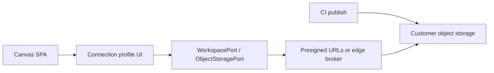

# 0013. Practitioner connection profiles for org-owned catalog buckets

## Context and Problem Statement

ADR-0010 defines the remote catalog contract. ADR-0011/0012 cover the **hosted** sandbox (public-read or edge-proxied R2). Slice 2 of the [remote blueprint catalog PRD](../remote-blueprint-catalog-prd.md) asks for **practitioner connection profiles**: Canvas (or a thin broker) connecting to a **customer-owned** S3-compatible bucket with the same consume protocol, without baking secrets into the SPA bundle.

This number was reserved in ADR-0010 / ADR-0014 follow-ups. Slice 2 is not started; auth and credential transport remain an open product decision. This record holds the reserved ADR id, drivers and options so references stay honest until a choice is accepted.

## Decision Drivers

- Hard to reverse: browser auth / credential shape becomes the customer integration surface
- Security: no long-lived secrets in the SPA bundle (PRD constraint)
- Compatibility: reuse ADR-0010 `latest` + snapshot layout and `WorkspacePort` (ADR-0012)
- Operability: CI publish credentials stay in the pipeline; Canvas read path may differ
- Scope: local-first authoring (ADR-0004) stays the default; org connect is opt-in

## Considered Options

- Option A - **Presigned URL / short-lived token exchange** - CI or an IdP issues time-boxed read URLs; Canvas never holds bucket keys
- Option B - **Public-read customer bucket** (same pattern as hosted sandbox) - simplest; weakest for private estates
- Option C - **Edge Worker / broker** - SPA talks to ArchLens-operated or customer Worker that holds credentials and proxies catalog GETs
- Option D - **Defer Slice 2** - keep hosted public catalog + CLI publish only until a paying/org use case forces auth

## Decision Outcome

Chosen option: "**Option D** (defer)" until Slice 2 is scheduled.

No browser connection-profile UI or customer-bucket adapter ships yet. When Slice 2 starts, revisit Options A-C against the threat model and pick one **Accepted** successor decision in this file (or a superseding ADR).

### Consequences

- Good, because ADR-0010/0014 references to “ADR-0013” resolve instead of pointing at a missing file
- Good, because hosted sandbox (ADR-0011/0012) can ship without pretending org auth is designed
- Bad, because customers cannot yet point Canvas at a private bucket from the UI
- Follow-up: when accepting A/B/C, update status to Accepted, lock the credential port in `@archlens/storage` and add Canvas composition wiring behind a connection-profile adapter

## Architecture sketch

Deferred shape (target when Slice 2 lands) - credentials stay outside the SPA:

## Links

- Related ADRs: [0010](./0010-remote-blueprint-catalog-contract.md), [0011](./0011-object-storage-published-corpora.md), [0012](./0012-remote-read-only-workspace-port.md), [0014](./0014-estate-fragments-and-compose-before-publish.md), [0004](./0004-local-first-fs-access-and-indexeddb-working-copy.md)
- Spec / PRD: [remote-blueprint-catalog-prd.md](../remote-blueprint-catalog-prd.md) (Slice 2, open decision #3)
- Arch norms: hexagonal ports for storage/auth; no secrets in the SPA bundle
