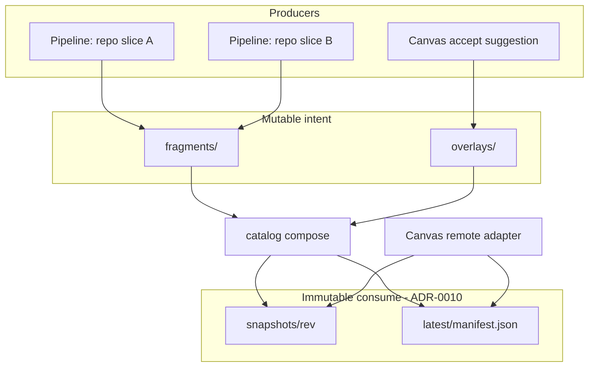

# 0014. Estate fragments and compose-before-publish

## Context and Problem Statement

Organisations scan **many pipelines** that may each own only a slice of architecture: one repo can contain many products, and one product can span many repos (or path subsets). ADR-0010 publishes a **whole tree** as an immutable snapshot and flips `latest`. That is correct for consumers, but concurrent whole-tree publishes **clobber** each other, and there is no remote merge path for shared `context.yaml` or accepted suggestion overlays.

We need a composition model that keeps immutable snapshots while allowing independent producers to contribute fragments keyed by **product** (not by git repo alone).

## Decision Drivers

- Hard to reverse: object layout and compose semantics become the multi-pipeline integration surface
- Matches domain: product membership is many-to-many with repos/slices (existing scan `productId` / `--system-name`)
- Operability: avoid lost updates without a shared database
- Compatibility: Canvas continues to read ADR-0010 `latest` + `snapshots/{rev}/` only
- Extensibility: AdviceLens / UI “add dependent” suggestions must become catalog intent without mutating frozen revisions

## Considered Options

- Option A — Status quo: one job builds the full tree, then ADR-0010 publish (aggregator outside ArchLens)
- Option B — Fragment staging + `catalog compose` that merges fragments (and overlays) into a new ADR-0010 snapshot with compare-and-swap on `latest`
- Option C — Mutable in-place bucket objects (no snapshots) edited by each pipeline
- Option D — Separate catalog per repo; Canvas federates many `latest` pointers

## Decision Outcome

Chosen option: "**Option B**", with **Option A** as the interim whole-tree publish pattern until compose ships.

**Validation policy:** catalog push paths (`publish`, `publish-fragment`, `compose`, `scan --publish`) default to **not** blocking on workspace validation. ArchLens prioritises honest visibility of architecture — including incomplete or intentionally invalid trees. Use `archlens validate` or `--validate` on a publish command only when a pipeline wants an optional hard gate. `--skip-validation` is always allowed and wins over `--validate`.

### Phase 0 (historical) → shared samples estate

Phase 0 briefly isolated whole-tree publishers under separate prefixes. Once fragment compose shipped, catalog producers all stage into the **shared `samples` estate** so Canvas can list every context:

| Publisher                                    | Fragment `productId` | Prefix (shared)    |
| -------------------------------------------- | -------------------- | ------------------ |
| Hand-authored `samples/`                     | `samples`            | `estates/samples/` |
| This-repo scan (`publish-blueprint-catalog`) | `archlens`           | `estates/samples/` |
| External demo matrix leg `{id}`              | `{id}`               | `estates/samples/` |

Canvas production builds use `VITE_REMOTE_CATALOG_BASE_URL=https://blueprints.archlens.dev/estates/samples/`. Layout under the prefix remains ADR-0010 (`latest/`, `snapshots/{rev}/`). Demo scans use `--context={id}` so BlueprintSpec paths do not collide across repos.

### Phase 1+ — fragment contract

A **fragment** is the unit a pipeline publishes:

| Field           | Meaning                                                         |
| --------------- | --------------------------------------------------------------- |
| `estateId`      | Landscape / org catalog id (prefix under `estates/{estateId}/`) |
| `productId`     | Composition key (many fragments may share it)                   |
| `systemId?`     | Optional system / path slice within a product                   |
| `sourceRef`     | Repo + commit or CI run id                                      |
| `objects[]`     | BlueprintSpec YAML paths + bytes for this slice                 |
| `contextDelta?` | Nodes/deps to merge into estate `context.yaml`                  |

Monorepo scans may emit **multiple** fragments (one per product). Multi-repo products emit fragments with the same `productId` and different `sourceRef` / `systemId`.

Staging keys (illustrative):

```text
estates/{estateId}/
  fragments/{fragmentKey}/{runId}/...
  overlays/{overlayId}.yaml          # accepted suggestions (Phase 3)
  latest/manifest.json               # composed ADR-0010 pointer
  snapshots/{revisionId}/...         # composed corpus
```

### Phase 2 — compose (implemented)

`archlens catalog compose --estate={estateId}`:

1. Load fragments under `fragments/` for the estate key prefix (`estates/{estateId}/` by default).
2. Keep the freshest run per `fragmentKey` (`publishedAt`, then `runId`).
3. Merge non-`context.yaml` paths with last-writer-wins; merge `context.yaml` by `entityRef`.
4. Build ADR-0010 `catalog.json` + snapshot, upload snapshot objects, **CAS** update `latest/manifest.json` (`If-Match` / `If-None-Match: *`) with retries (`--max-retries`, default 3).

Stage inputs with `archlens catalog publish-fragment … --estate=… --product=… --source-ref=… --no-dry-run`.

**Compose triggers (samples estate):** primary stitch is `publish-fragment` then `compose` in the same GitHub Actions job. A hourly `compose-catalog` workflow is the safety net (`--allow-empty`). Storage-event / Worker triggers are deferred.

### Phase 3 — suggestion overlays (implemented)

Suggestions do not edit snapshots. Accepting “add dependent” writes an overlay under `overlays/{overlayId}.yaml`; compose merges accepted overlays into the composed tree before publishing. Reject rewrites the same key with `status: rejected` (tombstone).

```bash
archlens catalog accept-overlay --estate=acme --file=overlay.yaml --no-dry-run
archlens catalog reject-overlay --estate=acme --overlay-id=add-billing --no-dry-run
archlens catalog compose --estate=acme --no-dry-run
```

Overlay document fields: `overlayId`, `estateId`, `status` (`accepted`|`rejected`), `kind` (`add-dependent`), `targetPath`, `sourceRef`, `acceptedAt`, `delta.nodes` / `delta.dependencies`. Local folder workspaces still apply via ADR-0004; remote catalog intent uses overlays.

### Consequences

- Good, because immutable snapshots and Canvas read path stay ADR-0010
- Good, because product (not repo) is the composition key — matches scan domain
- Good, because Phase 0 isolation stopped races; the hosted catalog now uses one shared estate with per-product fragments
- Bad, because compose + CAS is new CLI surface and needs conflict retry
- Good, because production Canvas loads one estate (`samples`) that unions hand-authored samples, ArchLens, and batch demos via fragments
- Follow-up: Canvas remote accept UI wiring; optional hard-delete once `deleteObject` exists on the storage port; ADR-0013 remains reserved for connection-profile auth; optional estate index if customers need multi-catalog browsing

## Architecture sketch



## Links

- Supersedes assumptions in the hosted samples estate only; extends [ADR-0010](./0010-remote-blueprint-catalog-contract.md)
- Storage host: [ADR-0011](./0011-object-storage-published-corpora.md)
- Local apply path for suggestions: [ADR-0004](./0004-local-first-fs-access-and-indexeddb-working-copy.md)
- Scan multi-repo: CLI `--context` + `--system-name` / `productId` partitioning
