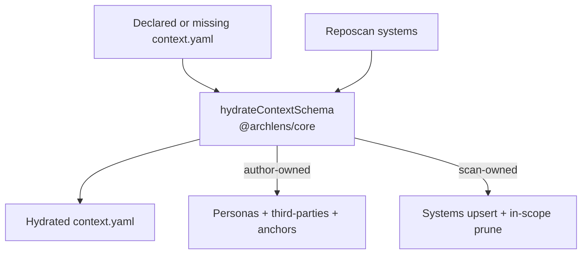

# 0015. Declared system context authorship and scan hydration

## Context and Problem Statement

Teams need to extend the architecture model beyond reposcan by declaring product personas and third-party dependencies on a system context BlueprintSpec. Scan must hydrate discovered systems into that declaration (or create a context when none exists) without erasing human intent, while remaining safe for multi-repo landscapes that share one context.

## Decision Drivers

- Hard to reverse: durable `properties.contextOwnership` stamps persist in committed YAML
- Preserve ADR-0001 (YAML SoT) and ADR-0002 (`entityRef`) without a new BlueprintSpec `kind`
- Multi-repo operability: prune orphans without deleting sibling-repo systems
- Canvas stays unchanged — reuse existing load/edit/DiffMenu

## Considered Options

- Option A — Pure core hydration plan (`hydrateContextSchema`) + CLI writer adapter; author vs scan ownership; prune by `rootPath` scope; optional context folder on seed path
- Option B — Always regenerate context from scan (status quo), keep personas only in samples
- Option C — New BlueprintSpec `kind: context` and separate declaration format
- Option D — Canvas merge-preview before every CLI write

## Decision Outcome

Chosen option: "**Option A**", because it reuses `level: context` BlueprintSpec, keeps merge logic in `@archlens/core` (TDD-friendly), and matches declare-then-scan workflows without Canvas changes or a new kind field.

### Consequences

- Good, because declared personas, third-parties, and sparse system anchors (`entityRef` + `name`) survive re-scan
- Good, because fallback `context-actor` User is omitted when product personas exist
- Good, because optional seed paths `blueprints/context.yaml` or `blueprints/<ctx>/context.yaml` prefer an existing file
- Bad, because ownership stamps add a persisted convention callers must honor
- Follow-up: scanner may pass `proposedThirdParties` into the same hydration plan later (not via workspace-proxy enrich on context)

## Architecture sketch

## Links

- Related ADRs: [ADR-0001](./0001-yaml-blueprintspec-as-canonical-format.md), [ADR-0002](./0002-entityref-hierarchical-diagram-identity.md), [ADR-0008](./0008-workspace-external-proxy-nodes.md)
- Spec / docs: [CLI README](../../app/packages/cli/README.md), `hydrateContextSchema` in `@archlens/core`
- Arch norms: hexagonal, DDD, vertical slices (kit `CODING_PHILOSOPHY.md`)
