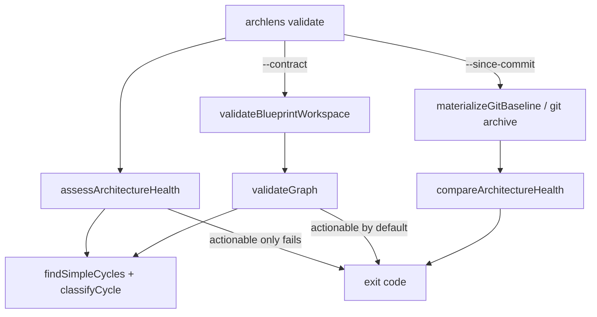

# 0015. Validate defaults to architecture health

## Context and Problem Statement

`archlens validate` historically meant BlueprintSpec **contract** checks (wiring, entity refs, any graph cycle). Practitioners instead want a gate that highlights **actionable codebase debt** — module `direct-call` cycles, hotspots, knowledge silos, heating — and optional regression versus a prior commit. Contract checks remain useful for publish/CI hard gates, but must not be the default story.

## Decision Drivers

- Hard to reverse: public CLI exit codes and GitHub Action `validate-blueprints` semantics
- Product clarity: health findings vs wiring contract are different jobs
- Consistency: canvas/`validateGraph` cycle failures should not be noisier than health for cycles
- Operability: existing pipelines can opt into contract with an explicit flag

## Considered Options

- Option A — Keep validate = contract; add `archlens health` (or similar) for forensics
- Option B — Default validate = architecture health; `--contract` for BlueprintSpec wiring; actionable-only cycles shared with health
- Option C — Single command that always fails on both health and full contract (including informational cycles)

## Decision Outcome

Chosen option: "**Option B**".

- `archlens validate` assesses architecture health (`assessArchitectureHealth` / optional `--since-commit` / `--baseline`).
- `--contract` runs BlueprintSpec workspace validation (invalid connections, broken refs, **actionable** cycles).
- Cycle discovery is shared (`findSimpleCycles` + `classifyCycle`); default fail set is **actionable** (non-external `direct-call`) for both health and contract. Informational cycles (external proxies, non-direct-call) do not fail unless `validateGraph(..., { cycles: 'all' })`.
- Publish paths stay optional (`--validate` / `--skip-validation` per ADR-0014).

### Consequences

- Good, because CI defaults match “what should we fix in the codebase?”
- Good, because contract and health no longer disagree on cycle severity
- Bad, because callers that expected validate to mean full wiring+all-cycles must pass `--contract` (and may need `cycles: 'all'` only if they embed the graph API)
- Follow-up: canvas UX may later surface informational cycles without failing the graph

## Architecture sketch

## Links

- Related ADRs: [0014](./0014-estate-fragments-and-compose-before-publish.md) (publish validation optional)
- Spec / handover: `~/.agents/handover/archlens/` (architecture health validate)
- Arch norms: pure assessment in `@archlens/core`; git/IO at CLI edge
