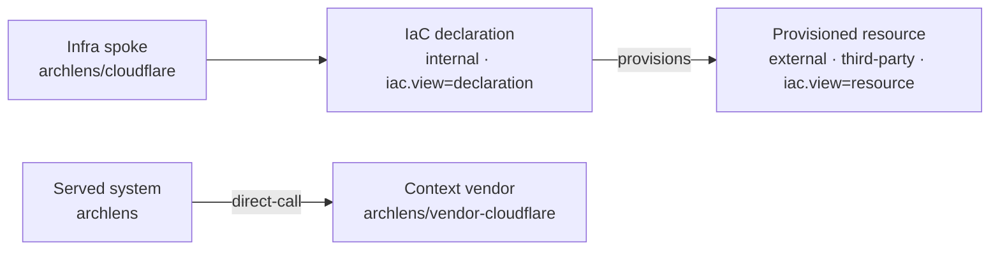

# 0016. Separate IaC declarations from provisioned infrastructure via `provisions`

## Context and Problem Statement

Meaningful IaC projection collapsed Pulumi/Terraform resource addresses into a single third-party product node (`external: true`). That conflated **code we own** (the declaration) with **cloud runtime surfaces** (Pages, R2, Lambda). Canvas and AdviceLens then treated the declaration like a peripheral external. We need distinct identities so behaviours differ and we can later surface IaC drift.

## Decision Drivers

- Hard to reverse: BlueprintSpec dependency enum + persisted scan YAML shape
- Boundary clarity: ownership of code vs third-party runtime
- Operability: keep vendor context hydration (ADR-0015) while fixing container modelling
- Extensibility: edge type reserved for future drift / desired-vs-actual comparisons

## Considered Options

- Option A - Dual nodes: internal IaC declaration + external provisioned resource, linked by new dependency type `provisions`
- Option B - Stop marking products `external` (IaC-only internal nodes; lose third-party semantics)
- Option C - Status quo single third-party product node with `iac.*` properties

## Decision Outcome

Chosen option: "**Option A**", because declaration and resource need different canvas, advice and resilience rules, and a non-runtime edge type keeps ChaosLens blast radius honest.

### Consequences

- Good, because IaC declarations stay first-class internal nodes under the infra spoke (full parse - including supporting/noise addresses)
- Good, because only **primary** provisioned products remain third-party externals for context vendors and external summary
- Good, because `provisions` is not an availability-propagating call (unlike `direct-call`)
- Bad, because container diagrams include more IaC nodes; scans must be re-run to refresh corpora
- Follow-up: IaC drift overlays comparing declaration addresses to observed cloud inventory

## Architecture sketch

## Links

- Related ADRs: [ADR-0015](./0015-declared-context-hydration.md), [ADR-0008](./0008-workspace-external-proxy-nodes.md), [ADR-0001](./0001-yaml-blueprintspec-as-canonical-format.md)
- Spec / docs: [Meaningful external dependencies](../guide/cli.md#meaningful-external-dependencies)
- Arch norms: hexagonal, DDD, vertical slices (kit `CODING_PHILOSOPHY.md`)
