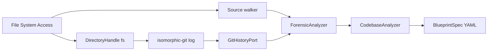

# 0018. Browser scan reads git history with isomorphic-git

## Context and Problem Statement

[ADR-0017](./0017-browser-structural-scan-vs-cli-forensics.md) kept in-tab scan structure-only so TraceLens git hotspots stayed on the CLI. First-time visitors who finished the Chaos → Advice demo then had no git signal unless they installed a binary. We still cannot run watch mode, CI publish, or the Bun CLI in the tab (WebContainer remains out of scope). The question is whether git history can share the CLI forensic analyzer without pulling Node `git log` into the browser.

## Decision Drivers

- Honesty: when `.git` is present (directory or gitdir file), the map should show the same hotspot/silo classifications as the CLI. Missing git copy is only for folders with no checkout; an empty lookback window is still a git checkout. Nested `.gitignore` patterns apply relative to that file’s directory.
- Hexagonal boundary: canvas must not depend on `@archlens/cli`; git adapters stay at the edge
- Tab operability: keep a file/byte cap so structured-clone into the worker stays responsive
- Reversibility: isomorphic-git is an adapter; `ForensicAnalyzer` stays in `@archlens/analysis`

## Considered Options

- Option A: isomorphic-git over File System Access, feeding the shared `ForensicAnalyzer` (content complexity + import graph in-memory)
- Option B: keep ADR-0017 structure-only and graduate git exclusively to the CLI
- Option C: WebContainer / OPFS running the Bun CLI (MZW-47)

## Decision Outcome

Chosen option: "**Option A**", because it reuses the CLI forensic domain (ports + `ForensicAnalyzer`) while swapping `GitLogHistoryAdapter` for isomorphic-git. The browser still does not claim watch mode or CI publish. When the folder has no `.git`, copy says the folder has no git — not that the tab cannot do git.

### Consequences

- Good, because TraceLens hotspots appear after a browser scan of a git checkout
- Good, because CLI and canvas share one analyzer in `@archlens/analysis`
- Bad, because in-tab complexity uses a control-flow heuristic rather than tree-sitter AST (CLI still uses tree-sitter)
- Bad, because file/byte caps remain; large monorepos still need the CLI
- Follow-up: ZIP upload (MZW-36) and optional tree-sitter complexity in the worker

## Architecture sketch

## Links

- Related ADRs: [ADR-0017](./0017-browser-structural-scan-vs-cli-forensics.md) (superseded for git-in-tab), [ADR-0007](./0007-shared-archlens-core-as-published-language.md)
- Issue: [MZW-39](https://linear.app/mzworthington/issue/MZW-39)
- Arch norms: hexagonal, DDD, vertical slices
