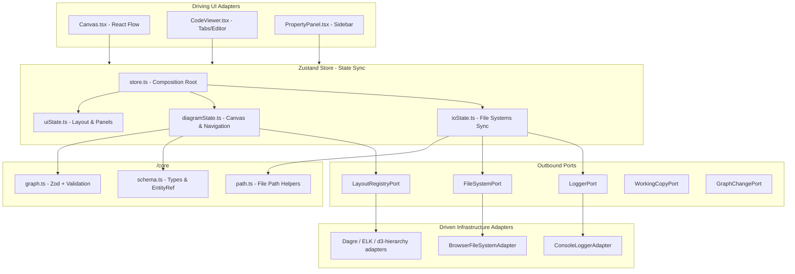
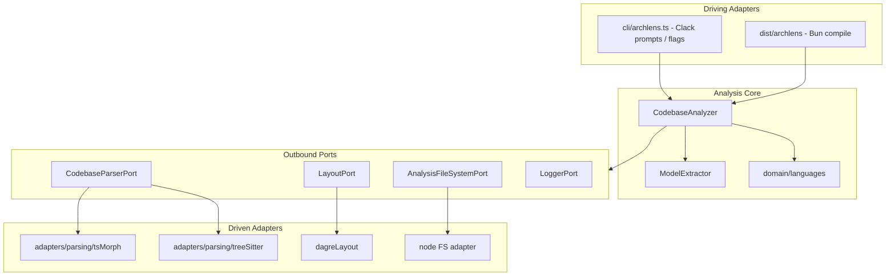

# System Architecture & Security

Contributor reference: high-level system architecture, dependency flow, module responsibilities, and validation boundaries.

For languages, frameworks, and hosting (React, Pulumi, Cloudflare, etc.), see [Technology stack](./tech-stack.md).

Hard-to-reverse design choices are recorded as sparse MADRs under [Architecture Decision Records](./ADRs/README.md).

Proposed realtime collaboration (Yjs shared working copy, not implemented): [Shared canvas collaboration](./plans/shared-canvas-collaboration.md).

For using ArchLens products, start with the [Product guide](./guide/index.md).

---

## Web Application Architecture

ArchLens Canvas adheres to Hexagonal Architecture: UI adapters talk to a Zustand store, which uses pure domain rules from `@archlens/core` and talks to the browser via ports/adapters.

---

## TypeScript CLI Architecture

The production CLI is `/cli` under `app/packages/cli/` (TypeScript / Bun). It uses hexagonal ports for parsing, layout, filesystem, and logging, and depends on `/core` for shared types and `EntityRef` helpers.

Folder map: `src/cli/` (entry), `src/analysis/{domain,adapters}` (with `languages/` and `parsing/` / `pathFilter/` subgroups), `src/forensics/`, `src/writers/`. See `/cli` README “Source layout”.

### Web-to-CLI filesystem bridge

1. The **TypeScript CLI** writes YAML under `blueprints/`.
2. **ArchLens Canvas** loads those files from an opened folder (File System Access API) or from **bundled demo YAML** baked into the production build at compile time (`defaultData.ts` imports `blueprints/context.yaml` and lazy-loads other files under `blueprints/`).
3. **Load sandbox** in ArchLens Canvas clears IndexedDB working copies and session caches, then reloads the bundled demo - it does not auto-hydrate stale drafts on startup.

> Experimental Rust sources under `/cli` are unmaintained and not part of the production pipeline.

---

## Architectural Components

### 1. Pure Domain Layer (`app/packages/core/src/`)

Shared by Canvas and CLI. TypeScript + Zod - no Protocol Buffers.

- **[schema.ts](../app/packages/core/src/models/schema.ts):** Domain types, `EntityRef` helpers, validation result types.
- **[graph.ts](../app/packages/core/src/rules/graph.ts):** Zod contracts, cycle detection, YAML/JSON parse & serialize, Mermaid export.
- **[mermaidImport.ts](../app/packages/core/src/rules/mermaidImport.ts) / [schemaMerge.ts](../app/packages/core/src/rules/schemaMerge.ts):** Parse Mermaid → `SystemSchema` and merge plans (canvas import wizard).
- **[terraformImport.ts](../app/packages/core/src/rules/terraformImport.ts):** Static Terraform HCL/JSON → `SystemSchema` (CLI IaC pass via `/cli`).
- **[workspaceExternals/](../app/packages/core/src/rules/workspaceExternals/):** Suggest / add external proxy nodes across loaded workspace schemas.
- **[resilience/](../app/packages/core/src/resilience/):** Fault specs, blast-radius propagation, SLA simulation (`/core/resilience` - Canvas resilience mode).
- **[path.ts](../app/packages/core/src/rules/path.ts):** Filesystem-agnostic relative path helpers for multi-file IO.
- **[entityRef.ts](../app/packages/core/src/lib/entityRef.ts):** Workspace FQN resolution. Hierarchy: child `schema.entityRef` equals parent node `entityRef`.

### 2. Canvas ports (`app/packages/canvas/src/core/models/ports.ts`)

- `FileSystemPort` / `WorkspacePort`: load and save schemas and directories.
- `LoggerPort`: structured logging.
- `LayoutRegistryPort` / `LayoutEnginePort`: client-side graph layout engines (dagre, ELK, d3-hierarchy).
- `WorkingCopyPort`: IndexedDB working-copy / baseline persistence and schema diffs.
- `GraphChangePort`: apply canvas node/edge change lists (React Flow adapter).
- `CollabSessionPort`: optional Yjs room (share-link); see [Shared canvas collaboration](./plans/shared-canvas-collaboration.md).

### 3. Canvas adapters & store (`app/packages/canvas/src/`)

- `infrastructure/fileSystem/` - browser FS Access adapters.
- `infrastructure/layout/` - graph layout adapters + `createBrowserLayoutRegistry` (engines lazy-loaded on first use).
- `infrastructure/db/` - IndexedDB working copy / baseline diffs.
- `infrastructure/collab/` - Yjs collab session + BroadcastChannel / WebSocket transports.
- Worker runtime: [`app/packages/collab`](../app/packages/collab) (`@archlens/collab`) — Durable Object rooms; not bundled into Pages.
- `infrastructure/network/` - online/offline status for the offline banner.
- `application/layout/` - pure layout use-case (`computeClientLayout`) and grid policy.
- `application/store/` - Zustand composition (`uiState`, `diagramState`, `ioState`, `resilienceState`).
- PWA (service worker via `vite-plugin-pwa`) caches the app shell for offline Canvas use.

### 4. TypeScript CLI (`app/packages/cli/src/`)

- `archlens.ts` - entry / prompts.
- `analysis/domain/` - analyzer, language strategies, model extraction.
- `writers/` - context / container / component YAML writers.

---

## Security & Validation

### 1. Syntactic schema check (Zod)

YAML/JSON is validated against shared Zod contracts in `/core`:

- Entity refs match `ENTITY_REF_PATTERN` (no path-style ids).
- Node types must match domain enums.

The same Zod contract is exported as JSON Schema (`schemas/blueprint.schema.json`) for IDE hints. Regenerate with `pnpm generate:schema`. Pre-commit and CI run `generate:schema -- --check` when `app/packages/core/` changes and fail if the files are stale.

Hosted on the Canvas site after deploy:

- https://archlens.dev/schemas/v4/blueprint.schema.json
- https://archlens.dev/schemas/latest/blueprint.schema.json
- https://archlens.dev/schemas/v1/chaos.schema.json
- https://archlens.dev/schemas/latest/chaos.schema.json

Wire format: [YAML format (v4)](./setup.md#yaml-format-v4). Live render in the product guide: [BlueprintSpec](./guide/schema.md), [ChaosSpec](./guide/chaos-spec.md).

### 2. Structural dependency check (DFS)

- Circular dependency loops are flagged and highlighted on the canvas.
