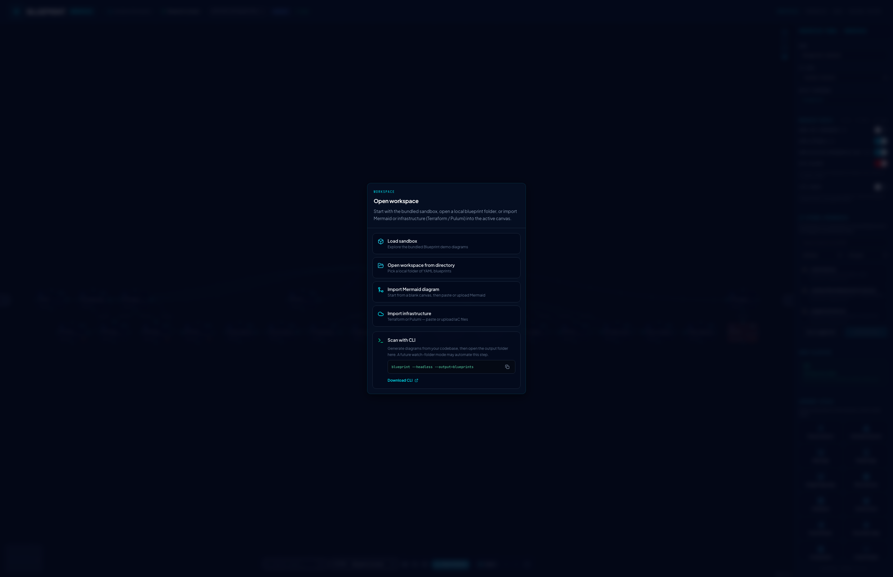

# Blueprint canvas

Blueprint canvas is a local-first C4 workspace. Diagrams are views over a strict schema — edit either side and the other stays in sync.

## Opening a workspace

On bare `/workspace`, a startup chooser asks how to begin:

| Option                            | What it does                                                                                     |
| --------------------------------- | ------------------------------------------------------------------------------------------------ |
| **Load sandbox**                  | Clear IndexedDB drafts, session layout cache, and undo history; load bundled demo diagrams fresh |
| **Open workspace from directory** | File System Access — pick a local `blueprints/` folder                                           |
| **Import Mermaid diagram**        | Reset to an empty canvas, then open the Mermaid import wizard                                    |
| **Import infrastructure**         | Reset to an empty canvas, then open the Terraform / Pulumi import wizard                         |

The app does **not** auto-load the sandbox on first paint. On bare `/workspace` you see the chooser over an empty canvas until you pick an option (or follow a deep link).

**Load sandbox** is the reset control for the bundled demo: it wipes local working-copy storage and in-memory session caches, then reloads the YAML shipped with the app build. Use it after regenerating diagrams from your codebase, or whenever you want a clean demo workspace without leftover drafts.

Deep links (`/workspace/…`) skip the chooser. You can open a folder, a single YAML file, or Mermaid again anytime from the toolbar **Open** menu.

## Layout

- **Canvas** — interactive diagram of systems, containers, and components
- **Left / right panels** — catalog, identity, properties, forensics, connections
- **Code viewer** — YAML / JSON / Mermaid of the active schema (Mermaid tab is export-only)
- **Breadcrumbs** — where you are in the hierarchy

Collapse panels for a clean canvas:

## Selection & properties

Click a node to select it and open the right-hand property panel. Edit name, type, properties, and connection descriptions. External systems render with dashed borders.

When a node carries `forensics` from Blueprint CLI, a **TraceLens** section appears in the property panel (readonly metrics + helper text). See [TraceLens](./tracelens.md).

## C4 navigation

- **Single-click** a node to select it (opens the property panel). Nodes with a child diagram are **not** zoomed on single click.
- **Double-click** a node that has a child diagram (`entityRef` match), or use its **Zoom** button, to drill in
- Press **Esc** or use breadcrumbs / zoom-out control to go back up

## Canvas ↔ schema sync

- Moving nodes, wiring edges, or editing properties updates the underlying schema
- Editing YAML/JSON in the code viewer redraws the canvas
- Workspaces can load multiple systems from a `blueprints/` folder and switch via the canvas system picker

## Import Mermaid

Bring an external flowchart or C4 Mermaid diagram into the **active** schema — Blueprint parses it to `SystemSchema`, previews the merge, and applies only what you approve.

1. Open **Import Mermaid** (startup chooser or toolbar **Open** menu).
2. Paste Mermaid or upload `.mmd` / `.md`.
3. Review the preview, additions, and any conflicts (keep existing / rename import / overwrite).
4. **Merge into diagram** — draft-only until you commit via Pending Changes. ELK layout runs after a successful merge.

Import is lossy: forensics, rich properties, and styling from Mermaid are not preserved. Do not edit the Code Viewer Mermaid tab expecting round-trip edits.

## Import infrastructure

Bring Terraform or Pulumi definitions into the **active** schema — Blueprint parses them statically to `SystemSchema`, previews the merge, and applies only what you approve.

1. Open **Import Infrastructure** (startup chooser or toolbar **Open** menu).
2. Paste IaC source or upload one or more files (`.tf`, `.tf.json`, `Pulumi.yaml`, `.ts`).
3. Choose a format or leave **Auto-detect** (Terraform HCL/JSON or Pulumi YAML/TypeScript).
4. Review resource preview, additions, and any conflicts (keep existing / rename import / overwrite).
5. **Merge into diagram** — draft-only until you commit via Pending Changes. ELK layout runs after a successful merge.

No `terraform init` or `pulumi preview` is required — parsing is static, like the CLI IaC passes. Unknown provider types warn and map to a default infra node type. Import Terraform and Pulumi sources in separate sessions (mixed-vendor batches are rejected).

## External dependencies

Pull entities that already exist elsewhere in the loaded workspace onto the current diagram as **external proxies** (dashed borders). Search by name/`entityRef`, filter by C4 level or type, then **Add selected** or **Sync suggested**.

Wire dependencies to those proxies as usual; at container level the CLI/designer can roll component-level externals up into inter-container edges.

After a CLI scan, Blueprint materializes cross-container dependency endpoints onto component diagrams — for example, shared library imports become component-level edges that appear as external proxy nodes on the child diagram. Container nodes show an **Externals (N)** badge when their child diagram includes external dependencies.

## Node Search & Filtering

Press **Cmd+K** (macOS) or **Ctrl+K** (Windows/Linux) to activate the search bar in the top-right toolbar. Start typing to filter components and systems in the active diagram. Use arrow keys to navigate and **Enter** to focus/select that node on the canvas. Hidden tests/externals (per workspace display) stay out of search results.

## Layout Engines

Blueprint features on-the-fly layout recalculation using three pluggable layout engines:

- **Dagre** (default) — Fast, standard layered directed graph layout
- **ELK** (Eclipse Layout Kernel) — High-quality layouts for complex diagrams
- **d3-hierarchy** — Tree structures (useful for pure nested hierarchies)

Toggle layouts using the layout selector dropdown in the top toolbar. Choosing a layout automatically recalculates positions and updates the underlying YAML coordinates.

## Component Catalog

When no node is selected, or when expanding the properties panel, you can instantiate new architectural nodes on the fly.

- Click on any archetype in the **Component Catalog** (e.g. Actor/Person, Web App, Database, Cache Store, Event Broker, Event, gRPC Service) to spawn it on the canvas.
- Once created, wire it up using the node's connection handles and fill in its specifications in the properties panel.

## Draft Changes & Baseline Comparison

As you edit systems and drag nodes, Blueprint keeps draft state local:

- **Bundled sandbox** — edits are tracked in browser IndexedDB until you reload via **Load sandbox** (which clears storage) or discard manually.
- **Opened folder** — drafts are tracked in IndexedDB against the on-disk baseline; **Commit** writes YAML back to the folder via the File System Access API.
- Click the **Pending Draft Changes** (compare) icon in the top header to see a comprehensive Git-style diff of added, modified, or deleted nodes and dependencies.
- You can **Revert** draft changes back to the baseline, or **Commit** them to persist (folder workspaces only).

## Schema Validation & Cycle Detection

The top header provides real-time semantic analysis of the workspace structure:

- **Valid:** The schema structure complies with all syntactic guidelines.
- **Cycle Detected:** The system has detected a circular dependency loop. Loop pathways will animate and highlight on the canvas in red to facilitate resolution.

## Workspace display

Under **Workspace display** in the properties panel (visible with or without a node selected):

| Toggle                              | Effect                                                                   |
| ----------------------------------- | ------------------------------------------------------------------------ |
| **Show Test Components**            | Reveal nodes marked `isTest` (hidden by default)                         |
| **Show Externals**                  | Show or hide external proxy nodes                                        |
| **Show Selected Dependencies Only** | When a node is selected, show only its upstream + downstream deps        |
| **Risk Heatmap**                    | Tint nodes by `hotspotScore` (see [TraceLens](./tracelens.md))           |
| **Lite Canvas**                     | Faster pan/zoom: hide minimap & grid, simplify nodes, cap edge animation |

Dependency edges draw an arrow toward the target (`from` → `to`). Selecting a node animates edges connected to it (all visible edges when focus mode is on; lite canvas caps animation to the selection neighborhood). `prefers-reduced-motion` disables edge dash animation entirely.

A summary line shows live counts (`ext · tests · deps`), scoped to the whole diagram or the selected node.

## ChaosLens

Model **what-if failures** on the diagram you already have open — same canvas, no separate route.

1. Click **Resilience** in the **bottom toolbar** (shield icon) to open **ChaosLens**. Header badge becomes **CHAOSLENS**; the right panel switches to fault controls + telemetry.
2. **Select a node**, configure fault type, severity, and safeguards (circuit breaker, bulkhead, retry, local cache).
3. Click **Simulate**. The canvas shows a **blast-radius heatmap** (red tint by impact); the panel shows SLA/SLO, SPOFs, and advice.

Simulation is display-only — YAML is not modified. TraceLens **Risk heatmap** is off while ChaosLens is active. See [ChaosLens](./chaoslens.md) for propagation rules and limitations.

## Offline / PWA

The designer installs as a Progressive Web App. After the first visit, the app shell can load offline so you can keep editing a local workspace; an offline banner appears when the network drops. When a newer build is deployed, an update banner at the top offers **Refresh** (recommended) so you load the latest hashed assets and service worker. Docs screenshots and public schema URLs are not required for offline canvas use.

## Next

- [Blueprint CLI](./cli.md) — how diagrams get generated
- [Design system](./design-system.md) — visual assets & identity sandbox
- [Interface tour & journeys](../journeys.md) — E2E-oriented walkthrough
