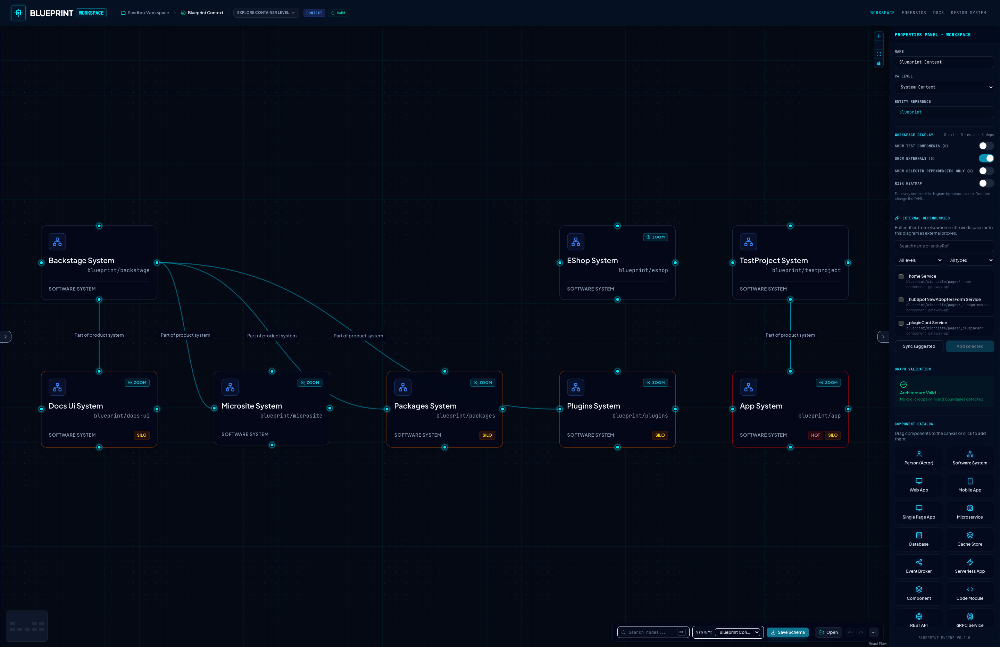
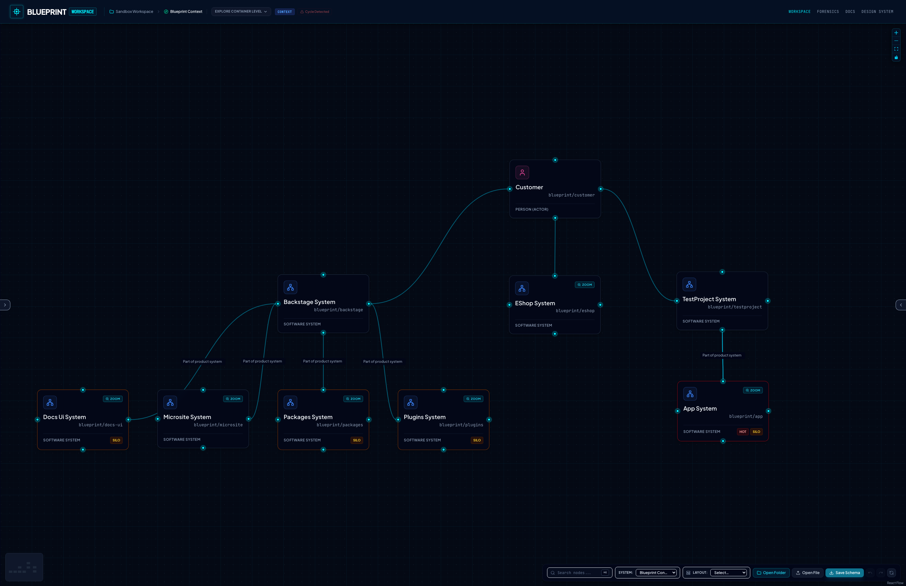
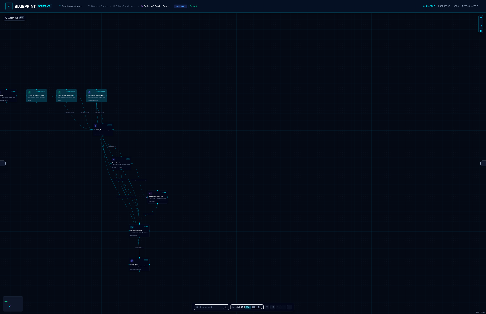
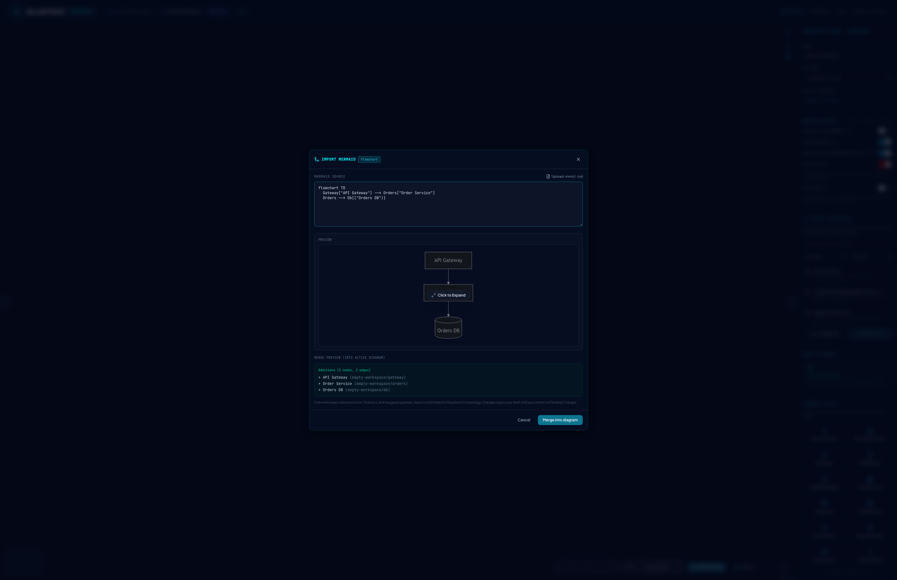
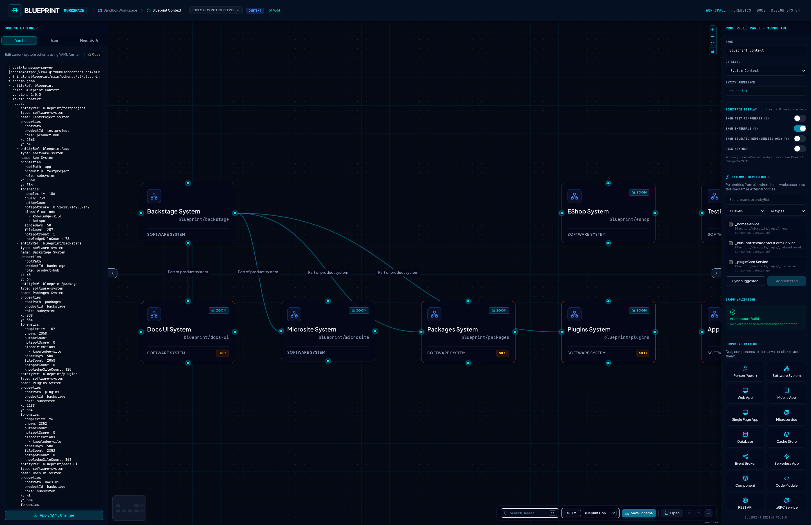

# ArchLens Canvas

ArchLens Canvas is the map over **BlueprintSpec**: author in a local folder, or browse a catalog your pipeline published. Diagrams are views over a strict schema. Edit either side and the other stays in sync.

## Opening a workspace

On bare `/workspace`, ArchLens shows a **startup chooser** - it does **not** auto-open the demo. Pick an **intent**, then a leaf action:

| Intent / option         | What it does                                                                                      |
| ----------------------- | ------------------------------------------------------------------------------------------------- |
| **Try the demo**        | Load the samples catalog and open **ChaosLens** on the golden journey (blast radius → AdviceLens) |
| **Full analysis (CLI)** | Collapsed strip under the demo: TraceLens git hotspots, watch mode and CI catalog publish         |
| **Investigate**         | Map real systems: browser lite scan, open blueprints folder or IaC import                         |
| **Collaborate**         | Share blank room, or open a folder/file then create a live share link                             |
| **Ideate**              | Solo blank canvas or import Mermaid (share later from the toolbar)                                |

Deep links (`/workspace/…`) skip the chooser and bootstrap the demo so entity URLs resolve. Opening a folder or running a browser scan this session prevents demo from overriding that choice.

You can open a folder, run a browser lite scan, load a single YAML file or import Mermaid/IaC anytime from the toolbar **Open** menu. After a browser scan, save the generated map to a blueprints folder (or download it) so later edits use draft/commit. Keep it in memory if you are still exploring.

## Layout

- **Canvas** - interactive diagram of systems, containers and components
- **Explorer** (left) - **TraceLens** and **Schema** tabs: forensics lenses, dependency view and YAML / JSON / Mermaid for the active schema
- **Properties** (right) - identity, metadata, connections, catalog and validation
- **Breadcrumbs** - where you are in the hierarchy

On **desktop**, use the chevron rails at the panel edges to expand or collapse Explorer and Properties. On **mobile**, **Explorer** and **Props** chips in the toolbar open the left and right panels when both are collapsed.

The **bottom toolbar** (row 2) has layout engine controls, **Lite** canvas and **Resilience** (ChaosLens) with **Simulate** when a scenario is active.

Collapse panels for a clean canvas:

## Selection & properties

Click a node to select it and open the right-hand **Properties** panel. Edit name, type, properties and connection descriptions. External systems render with dashed borders.

Forensics metrics, coupling lens, dependency view and canvas display toggles live in Explorer → **TraceLens** - not in Properties. See [TraceLens](./tracelens.md).

## C4 navigation

- **Single-click** a node to select it (opens the Properties panel). Nodes with a child diagram are **not** zoomed on single click.
- **Double-click** a node that has a child diagram (`entityRef` match), or use its **Zoom** button, to drill in
- Press **Esc** or use breadcrumbs / zoom-out control to go back up

## Canvas ↔ schema sync

- Moving nodes, wiring edges or editing properties updates the underlying schema
- Editing YAML/JSON in Explorer → **Schema** redraws the canvas
- Workspaces can load multiple systems from a `blueprints/` folder and switch via the canvas system picker

## Import Mermaid

Bring an external flowchart or C4 Mermaid diagram into the **active** schema - ArchLens parses it to `SystemSchema`, previews the merge and applies only what you approve.

1. Open **Import Mermaid** from the toolbar **Open** menu (requires an active diagram).
2. Paste Mermaid or upload `.mmd` / `.md`.
3. Review the preview, additions and any conflicts (keep existing / rename import / overwrite).
4. **Merge into diagram** - draft-only until you commit via Pending Changes. ELK layout runs after a successful merge.

Import is lossy: forensics, rich properties and styling from Mermaid are not preserved. Do not edit the Code Viewer Mermaid tab expecting round-trip edits.

## Import infrastructure

Bring Terraform or Pulumi definitions into the **active** schema - ArchLens parses them statically to `SystemSchema`, previews the merge and applies only what you approve.

1. Open **Import Infrastructure** from the toolbar **Open** menu (requires an active diagram).
2. Paste IaC source or upload one or more files (`.tf`, `.tf.json`, `Pulumi.yaml`, `.ts`).
3. Choose a format or leave **Auto-detect** (Terraform HCL/JSON or Pulumi YAML/TypeScript).
4. Review resource preview, additions and any conflicts (keep existing / rename import / overwrite).
5. **Merge into diagram** - draft-only until you commit via Pending Changes. ELK layout runs after a successful merge.

No `terraform init` or `pulumi preview` is required - parsing is static, like the CLI IaC passes. Unknown provider types warn and map to a default infra node type. Import Terraform and Pulumi sources in separate sessions (mixed-vendor batches are rejected).

**CLI vs Canvas:** `archlens scan` applies **meaningful external** projection (vendor third-parties on context; primary products on containers; noise filtered). Canvas Import merges the parsed resource graph into the **active** diagram without that filter today - use CLI scan when you want pack-based significance. See [Meaningful external dependencies](./cli.md#meaningful-external-dependencies).

## External dependencies

Pull entities that already exist elsewhere in the loaded workspace onto the current diagram as **external proxies** (dashed borders). Search by name/`entityRef`, filter by C4 level or type, then **Add selected** or **Sync suggested**.

Wire dependencies to those proxies as usual; at container level the CLI/Canvas can roll component-level externals up into inter-container edges.

After a CLI scan, ArchLens materializes cross-container dependency endpoints onto component diagrams - for example, shared library imports become component-level edges that appear as external proxy nodes on the child diagram. Container nodes show an **Externals (N)** badge when their child diagram includes external dependencies.

## Node Search & Filtering

Press **Cmd+K** (macOS) or **Ctrl+K** (Windows/Linux) to activate the search bar in the top-right toolbar. Start typing to filter components and systems in the active diagram. Use arrow keys to navigate and **Enter** to focus/select that node on the canvas. Hidden tests/externals (per workspace display) stay out of search results.

## Layout Engines

ArchLens Canvas features on-the-fly layout recalculation using three pluggable layout engines:

- **Dagre** (default) - Fast, standard layered directed graph layout
- **ELK** (Eclipse Layout Kernel) - High-quality layouts for complex diagrams
- **d3-hierarchy** - Tree structures (useful for pure nested hierarchies)

Toggle layouts using the layout selector dropdown in the top toolbar. Choosing a layout automatically recalculates positions and updates the underlying YAML coordinates.

## Component Catalog

When no node is selected, or when expanding the properties panel, you can instantiate new architectural nodes on the fly.

- Click on any archetype in the **Component Catalog** (e.g. Actor/Person, Web App, Database, Cache Store, Event Broker, Event, gRPC Service) to spawn it on the canvas.
- Once created, wire it up using the node's connection handles and fill in its specifications in the properties panel.

## Draft Changes & Baseline Comparison

As you edit systems and drag nodes, ArchLens Canvas keeps draft state local:

- Bundled sandbox - edits are tracked in browser IndexedDB until you reload via **Try the demo** or discard manually. When `VITE_REMOTE_CATALOG_BASE_URL` is set, the sandbox YAML comes from the hosted catalog rather than build-time embeds.
- **Opened folder** - drafts are tracked in IndexedDB against the on-disk baseline; **Commit** writes YAML back to the folder via the File System Access API.
- Click the **Pending Draft Changes** (compare) icon in the top header to see a comprehensive Git-style diff of added, modified or deleted nodes and dependencies.
- You can **Revert** draft changes back to the baseline, or **Commit** them to persist (folder workspaces only).

## Schema Validation & Cycle Detection

The top header provides real-time semantic analysis of the workspace structure:

- **Valid:** The schema structure complies with all syntactic guidelines.
- **Cycle Detected:** The system has detected a circular dependency loop. Loop pathways will animate and highlight on the canvas in red to facilitate resolution.

## Workspace display & Lite canvas

Canvas visibility and TraceLens overlays are in Explorer → **TraceLens** tab → **Workspace display**:

| Toggle                              | Effect                                                              |
| ----------------------------------- | ------------------------------------------------------------------- |
| **Show Test Components**            | Reveal nodes marked `isTest` (hidden by default)                    |
| **Show Externals**                  | Show or hide external proxy nodes (upstream / downstream bands)     |
| **Show Selected Dependencies Only** | When a node is selected, show only its upstream + downstream deps   |
| **Risk Heatmap**                    | Tint nodes by `hotspotScore` (see [TraceLens](./tracelens.md))      |
| **Coupling Lens**                   | Focus coupled peers on the canvas (see [TraceLens](./tracelens.md)) |

**Lite canvas** is a separate toggle on the bottom toolbar (**Lite** button): faster pan and zoom on large diagrams - hides minimap/grid, simplifies nodes, caps edge animation.

Dependency edges draw an arrow toward the target (`from` → `to`). Selecting a node animates edges connected to it (all visible edges when focus mode is on; lite canvas caps animation to the selection neighborhood). `prefers-reduced-motion` disables edge dash animation entirely.

A summary line in **Workspace display** shows live counts (`callers · targets · tests · deps`), scoped to the whole diagram or the selected node.

## ChaosLens

Model **what-if failures** on the diagram you already have open - same canvas, no separate route.

1. Click **Resilience** in the **bottom toolbar** (shield icon) to open **ChaosLens**. Header badge becomes **CHAOSLENS**; the right panel switches to fault controls + telemetry.
2. **Select a node**, configure fault type, severity and safeguards (circuit breaker, bulkhead, retry, local cache).
3. Click **Simulate**. The canvas shows a **blast-radius heatmap** (red tint by impact); the panel shows SLA/SLO, SPOFs and advice.

Simulation is display-only - YAML is not modified. TraceLens **Risk heatmap** is off while ChaosLens is active. See [ChaosLens](./chaoslens.md) for propagation rules and limitations.

## Offline / PWA

ArchLens Canvas installs as a Progressive Web App. After the first visit, the app shell can load offline so you can keep editing a local workspace; an offline banner appears when the network drops. When a newer build is deployed, an update banner at the top offers **Refresh** (recommended) so you load the latest hashed assets and service worker. A visible tab looks for that deploy right away and about once a minute, so you do not have to leave the tab first. Docs screenshots and public schema URLs are not required for offline canvas use.

## Next

- [ArchLens CLI](./cli.md) - how diagrams get generated
- [Design system](/design-system) - visual assets & identity sandbox
- [Interface tour & journeys](../journeys.md) - E2E-oriented walkthrough
