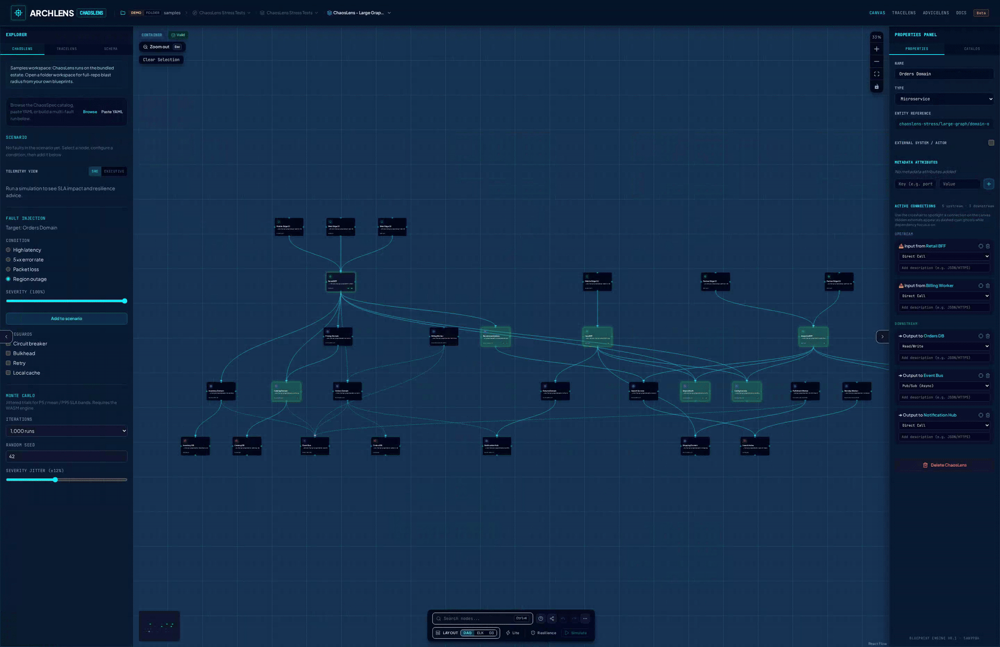

# ChaosLens

**ChaosLens** simulates **what-if failures** on the architecture you already have open in ArchLens Canvas, without a separate diagram or route. It runs on the normal workspace canvas against the active diagram.



Results are **illustrative**: statistical availability bands from simplified propagation, not production SLO guarantees.

## Turning it on

1. Open **`/workspace`** and load a diagram (sandbox, folder or deep link).
2. In the **bottom toolbar**, click **Resilience** (shield icon) to open ChaosLens.
3. The header badge switches to **CHAOSLENS** and the right panel shows fault controls + telemetry instead of property editing.

Click **Resilience** again to exit ChaosLens. Simulation state and safeguard toggles are cleared.

## Running a simulation

1. **Select a node** on the canvas (single click - use the **Zoom** button or double-click to drill into child diagrams).
2. In the right panel, choose:
   - **Fault type** - high latency, 5xx error rate, packet loss or region outage
   - **Severity** - 0-100% slider
   - **Safeguards** - circuit breaker, bulkhead, retry, local cache (session toggles on the selected node)
3. Click **Simulate** in the bottom toolbar.

The right panel opens if it was collapsed. Re-run after changing fault or safeguards.

When the Monte Carlo engine is available, telemetry also shows **P5 / mean / P95** SLA bands from jittered trials (typically 1,000 runs). Without WASM, the TypeScript fallback runs the same propagation rules (including group boundaries) and reports a single overall SLA.

With a **workspace** loaded, Simulate also builds a **simulation closure**: missing external neighbors are materialized, upstream callers stay in scope and edges from an external proxy’s **home diagram** are pulled in so blast radius can cross diagram boundaries (for example Auth Session DB → Auth → Storefront API).

## What the simulation models

Dependencies use BlueprintSpec’s usual direction: `{ from: 'web', to: 'api' }` means **Web calls API**.

Failures propagate **upstream** to callers (who depend on the faulted node), not downstream to dependencies - for **availability** (red heat, SLA).

**Publish-subscribe** edges also drive a separate **data integrity** track (amber heat): when a **publisher** faults, the broker and peer subscribers on the same topic show staleness without necessarily degrading entry-point SLA. When the **broker** faults, both availability and integrity degrade for all attached clients.

| Step              | Behavior                                                                    |
| ----------------- | --------------------------------------------------------------------------- |
| Origin            | Faulted node gets base severity (region outage ≈ 100%, latency ≈ 40%, etc.) |
| Propagation       | Each hop upstream multiplies severity by **0.75**                           |
| Circuit breaker   | Stops propagation above that node; node still shows local impact            |
| Local cache       | Halves incoming severity on that caller                                     |
| Retry             | Amplifies severity by **×1.2** (retries worsen cascades)                    |
| Bulkhead          | Caps propagation to **2 hops** past that node                               |
| Pub-sub integrity | Publisher fault → broker + peer subscribers at reduced severity (×0.5)      |

**Entry points** are nodes nothing else depends on (top of the call chain). Each entry point’s SLA is `(1 − availability heat) × 100%`. **Overall SLA** is the average across entry points. **Overall integrity** is separate - average correctness across nodes with integrity impact.

**SPOFs** (single points of failure) are dependencies with **two or more callers** and no circuit breaker recorded on the node (see schema below).

## On the canvas

After simulation:

- Nodes tint **red** by availability blast heat; **amber** when integrity is impacted without availability loss (display-only - YAML is unchanged).
- The **fault target** gets an orange border.
- **SPOF** nodes get an amber label.
- The **Risk heatmap** (TraceLens) is suppressed while ChaosLens is active.

Heat is transient canvas styling, same pattern as the TraceLens hotspot overlay.

## Right panel telemetry

| Section                      | Meaning                                                                                       |
| ---------------------------- | --------------------------------------------------------------------------------------------- |
| **Telemetry view**           | **SRE** (entity refs, Monte Carlo, SPOFs) or **Executive** (plain-English continuity summary) |
| **SLA / SLO**                | Overall and per-entry-point availability after the fault (SRE view)                           |
| **Data integrity**           | Correctness / staleness on async streams (independent of SLA)                                 |
| **Monte Carlo**              | When available - mean, P5 and P95 SLA across jittered trials                                  |
| **Single points of failure** | Shared dependencies lacking circuit breakers (structural, not fault-specific)                 |
| **Impacted domains**         | Parent diagram or top-level ref prefix for impacted nodes (availability)                      |
| **Resilience advice**        | Rule-generated suggestions (SPOFs, blast radius, integrity / staleness)                       |

## Persisting safeguards in YAML

Safeguard toggles in ChaosLens are written to the active diagram draft as top-level `resilience` on the node (alongside `forensics`). They appear in Explorer → **Schema** (YAML/JSON) and in **Pending Draft Changes** before you commit.

You can also author them by hand:

```yaml
nodes:
  - entityRef: shop/api
    name: API Gateway
    type: gateway-api
    resilience:
      circuitBreaker: true
```

The simulation reads `node.resilience` when no UI override exists for that node.

## ChaosSpec scenarios

Version-controlled failure scenarios live in `chaos-specs/` as YAML that references a blueprint diagram by `metadata.diagramRef` (no duplicated topology). Browse the catalog from **Open → Browse ChaosSpecs** (or ChaosLens **Browse**) to jump to the target diagram and load the scenario. Paste/upload and export remain under **Load ChaosSpec** / **Export ChaosSpec**.

Contract, public schema URLs and field reference: **[ChaosSpec](./chaos-spec.md)**.

## Limitations (today)

- Multi-fault scenarios via the scenario list, **Browse ChaosSpecs** catalog or paste/upload import
- Load and export ChaosSpec from the shared **ChaosSpec** dialog (Import / Export tabs); catalog picker navigates by `diagramRef`
- WASM Monte Carlo when the resilience engine is deployed; TypeScript fallback uses the same propagation rules without trial bands
- Headless estate sweep and CI SLA gates ship via **[AdviceLens](./advicelens.md)** (`archlens resilience`, `.github/actions/advicelens-gate`) - not a separate ChaosLens-only binary
- No OpenTelemetry import
- SLA numbers are heuristic, not queue/timeout/pool modeling
- Executive view omits revenue and user-journey mapping (planned for a later iteration)

## Next

- [AdviceLens](./advicelens.md) - ranked recommendations from simulation + forensics
- [ArchLens Canvas](./canvas.md) - panels, display toggles, navigation
- [TraceLens](./tracelens.md) - hotspot heatmap (disabled during ChaosLens)
- [ChaosSpec](./chaos-spec.md) - scenario contract and public schema URLs
- [BlueprintSpec](./schema.md) - `dependencies` and `entityRef` rules
- [ChaosLens engine](../chaoslens-engine.md) - Go/WASM engine, local WASM build, core API (contributors)
