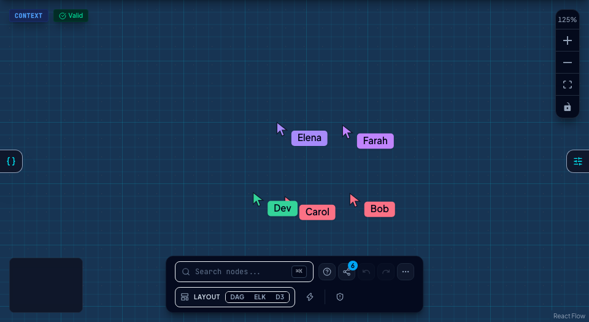

# Collaborate

Share a **live editing link** and join a room with your peers on the same BlueprintSpec map. Named cursors show who is looking where. Writing YAML back to disk still goes through **Pending Changes**.

Live share is an opt-in room, not a second source of truth. Folder workspaces stay local-first. Published catalogs stay a CI publish. See [Privacy](../privacy.md) for what a room actually sends.

## Why it is on the chooser

Architecture review usually dies as screenshots, an exported PNG or a YAML file that diverges the moment someone edits it. **Collaborate** keeps the conversation on the live map: nodes, dependencies, `entityRef` identity and layout.

Invite peers into the room for a walkthrough, a design session or a review. Do not use it as a team wiki, a catalog or a substitute for git.

## Start a room

On bare `/workspace`, pick **Collaborate**:

| Option               | What it does                                          |
| -------------------- | ----------------------------------------------------- |
| **Share blank room** | Empty canvas plus a live editing link                 |
| **Folder**           | Open a blueprints directory, then create a share link |
| **File**             | Open a YAML blueprint, then create a share link       |

You can share later from any open diagram: toolbar **Share live diagram**. Ideate (solo blank or import Mermaid) stays solo until you share.

The share dialog asks for **Your name** (1–40 characters). That name is what others see on your cursor. **Copy link** puts a URL with `?room=` on the clipboard.

## Who can join

No ArchLens account. The host chooses access when copying the link:

| Who can join             | What guests need                                                                                           |
| ------------------------ | ---------------------------------------------------------------------------------------------------------- |
| **Anyone with the link** | The URL. A forwarded link is enough to edit.                                                               |
| **Require a secret**     | The URL plus a secret (at least 8 characters). The secret is **not** in the link. Tell people out of band. |

Peers open the link, enter a display name and (if the host set one) the secret. The diagram stays hidden until that succeeds. A wrong secret does not reveal the map.

**End automatically** can keep the room until you end it, or close it in 8 hours or 24 hours. The host can also **End this session**.

The toolbar badge is a **connected count that includes you**. Open **Share live diagram** again to see **In this session** (names and colours). Peer pointers appear on your canvas with those names; your own pointer is not drawn on your view.

## What the room syncs

The room is a shared **working copy** of the active diagram: nodes, dependencies, identity and layout. Peers see structural edits as they land.

These stay on each browser, not in the room:

- TraceLens overlays (risk heatmap, coupling lens)
- ChaosLens blast-radius heat and telemetry
- IndexedDB drafts vs on-disk YAML until someone **Commit**s via Pending Changes

**Undo** and **Redo** are unavailable while a share session is active (local snapshot undo does not compose with live edits).

## What a room is not

- Not a published catalog. Pipeline → object storage → Canvas is still [CLI publish](./cli.md).
- Not disk. Folder **Commit** remains the only write back to YAML.
- Not comments, threads or multi-file workspace rooms.
- Not product sign-in. Treat an open link like a meeting URL.

On the hosted app, peers on other machines join through the collab Worker (`collab.archlens.dev`). Local builds without a collab WebSocket URL only share across **tabs on the same machine**.

## Join from a link

Deep links with `?room=` skip the startup chooser. Peers still enter a display name (and a secret when the host required one) before the diagram appears.

## Next

- [ArchLens Canvas](./canvas.md) - chooser, panels, drafts and commit
- [Privacy](../privacy.md) - local drafts vs live session
- [Jobs for today](./jobs.md)
