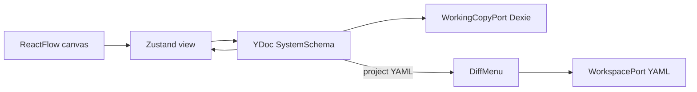
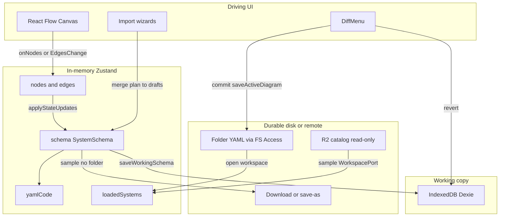
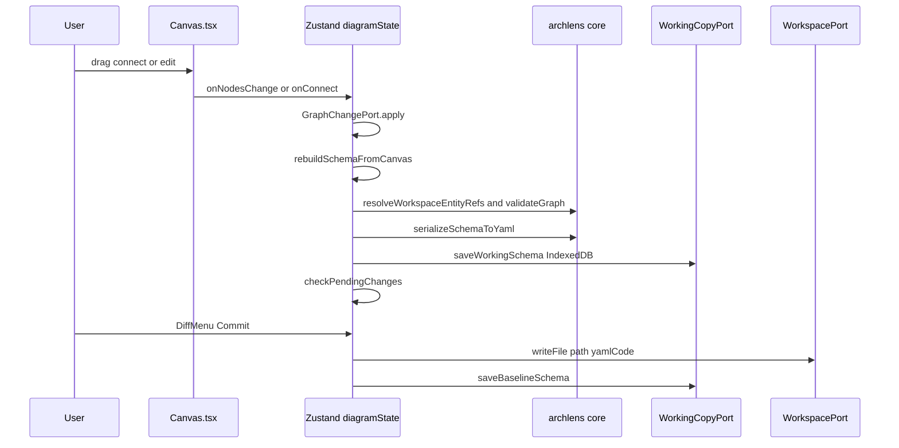
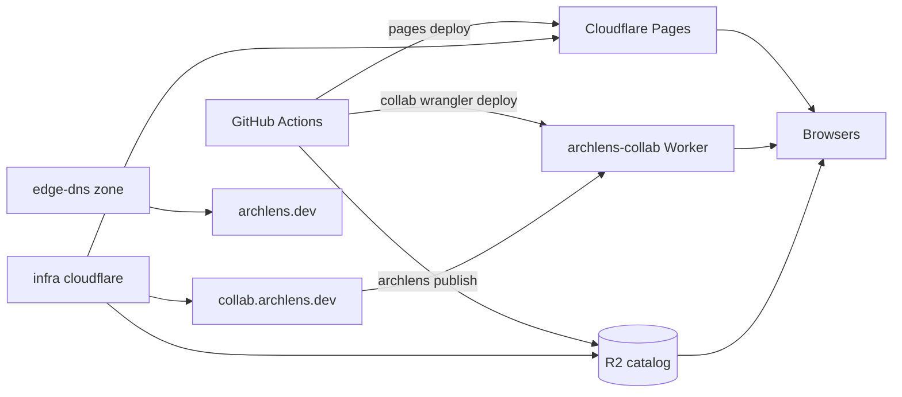

# Shared canvas collaboration

**Status:** Slice B in progress · **Last updated:** 2026-09-01 · **Implementation:** core mapping + Canvas session; Worker in `app/packages/collab/`; production hostname `collab.archlens.dev`

Contributor design for realtime co-editing of ArchLens diagrams. Local-first folder workspaces stay as they are ([ADR-0004](../ADRs/0004-local-first-fs-access-and-indexeddb-working-copy.md)). Collaboration is an **opt-in session**, not a replacement for File System Access or IndexedDB drafts.

Related: [Architecture](../architecture.md), [Technology stack](../tech-stack.md), [Remote catalog PRD](../remote-blueprint-catalog-prd.md) (lists multi-user realtime as a non-goal for catalog releases — that non-goal will need a later edit when this ships).

Do **not** write an ADR in this pass. Yjs as the shared working copy is ADR-worthy; sparse MADRs wait until the choice is committed in code ([ADRs](../ADRs/README.md)).

---

## Product scope

| Slice      | Ships                                                                                                                                                                                       | Deferred           |
| ---------- | ------------------------------------------------------------------------------------------------------------------------------------------------------------------------------------------- | ------------------ |
| **B (v1)** | Shared live diagram **and** shared `SystemSchema`: nodes, dependencies, `entityRef`, layout positions, merge into the working copy. DiffMenu remains the only disk write, still user-gated. | —                  |
| **C**      | Comments/threads, presence/cursors, first-class collab-vs-disk conflict preview, multi-file workspace rooms                                                                                 | Explicit follow-up |

Share-link rooms (room id in the URL, optional display name) are the slice-B default. There is no product auth today; Access or accounts wait for slice C.

### Feature flags (iteration)

Flags live in `localStorage` (`archlens.feature.<id>`). Toggle them from **More actions → Feature flags** on the workspace toolbar. Collaboration is one catalogued id (`collaboration`). Add/remove ids as slices come and go; do not copy the gate.

Share links carry `?room=` only. Each browser must turn Live collaboration on from the flags modal.

---

## CRDT choice: Yjs

**Yjs** (MIT) is the CRDT for this work.

Sync **`SystemSchema`**, not the YAML string and not the React Flow graph. The canvas is a projection. YAML BlueprintSpec remains the sole **on-disk** source of truth ([ADR-0001](../ADRs/0001-yaml-blueprintspec-as-canonical-format.md)). The Y.Doc is the **shared working copy**.

| Option                    | Verdict                                                                                                                                                                                                                                               |
| ------------------------- | ----------------------------------------------------------------------------------------------------------------------------------------------------------------------------------------------------------------------------------------------------- |
| **Yjs**                   | **Choose.** MIT; `Y.Map` keyed by `entityRef` matches [ADR-0002](../ADRs/0002-entityref-hierarchical-diagram-identity.md); Awareness is the slice-C presence path; `y-indexeddb` can sit beside Dexie; Durable Object providers exist for Cloudflare. |
| Automerge                 | Reject for v1. Weaker canvas/presence ecosystem.                                                                                                                                                                                                      |
| Loro                      | Reject for v1. Stronger history/checkout, weaker collab adapters and Awareness-style presence.                                                                                                                                                        |
| YAML in `Y.Text`          | Reject. A text CRDT mangles structured merge.                                                                                                                                                                                                         |
| CRDT the React Flow graph | Reject. RF is a view; overlays (coupling ghosts, resilience heat) must not enter the document.                                                                                                                                                        |

Cloudflare path: a **new Worker + Durable Object** in the ArchLens account (FOSS such as `y-durableobjects`), not PartyKit-as-a-service. Rooms live next to existing Pulumi in [`infra/cloudflare/index.ts`](../../infra/cloudflare/index.ts).

---

## Target architecture (slice B)



### Hexagonal seam

Add a new outbound **`CollabSessionPort`**. Do not overload the read-only remote catalog `WorkspacePort`, and do not leak Yjs types into UI or Zustand slices.

Wire the adapter only at [`createBrowserPorts.ts`](../../app/packages/canvas/src/composition/createBrowserPorts.ts). Local-only mode keeps today's Dexie path with no provider attached.

### Y.Doc shape

| Shared type            | Key              | Contents                                                |
| ---------------------- | ---------------- | ------------------------------------------------------- |
| `meta` `Y.Map`         | —                | `name`, `version`, `level`, `entityRef`                 |
| `nodes` `Y.Map`        | `entityRef`      | Nested maps per node (not a JSON blob, not a `Y.Array`) |
| `dependencies` `Y.Map` | `from\|to\|type` | Nested maps per edge                                    |

Positions are **one last-write-wins object per node**, committed on drag end. Independent `x` / `y` keys can fork into a position nobody intended.

Ephemeral overlays stay **out** of the CRDT.

### Mutation ownership

Today every structural edit rebuilds schema + YAML + IndexedDB via `applyStateUpdates`. Remote Yjs updates must **own** that pipeline, or local rebuilds will clobber peers.

Local undo (`past` / `future` snapshot stacks) does not compose with remote ops. Under a collab session use `Y.UndoManager` or disable undo.

Validation (`validateGraph`) may go invalid mid-merge (cycles, dangling edges). Slice B policy: **soft-warn**, do not reject the CRDT apply.

### Infra (greenfield)

Pages stays static. A collab backend needs:

1. Worker (or Pages Function) with Durable Object bindings
2. Hostname (for example `collab.archlens.dev`) plus DNS in ArchLens Pulumi — [edge-dns](https://github.com/mzworthington/edge-dns) owns the `archlens.dev` zone; this repo owns product DNS records
3. Share-link rooms for slice B; auth later
4. Canvas adapter on `CollabSessionPort`

Keep R2 as catalog/snapshot storage. Durable Objects hold live room state. `@archlens/storage` stays the CI/CLI publish port — wrong layer for realtime rooms.

---

## Exploration: canvas today

**Bottom line:** ArchLens Canvas is a **local-first, single-user SPA**. Edits live in Zustand + React Flow, draft to IndexedDB, and commit to disk via DiffMenu. There is no realtime sync, WebSocket, Durable Object, presence, or multi-user session. Collaboration-like behavior today is import conflict preview, baseline vs working-copy diffs, and URL deep links. Multi-user realtime is an explicit non-goal of the remote catalog PRD.

### Rendering and state

Primary surface: [`Canvas.tsx`](../../app/packages/canvas/src/ui/features/workspace/components/Canvas/Canvas.tsx). Library: React Flow (`@xyflow/react` ^12.11.2). Custom node types: `BlueprintNode`, `BlueprintGroupNode`. Display graph can add ephemeral overlays via `useCanvasDisplayGraph` — not persisted to schema.

Zustand store `useBlueprintStore` ([`store.ts`](../../app/packages/canvas/src/application/store/store.ts)) composes five slices:

| Slice                  | Path                                             | Role                                  |
| ---------------------- | ------------------------------------------------ | ------------------------------------- |
| Composition            | `application/store/store.ts`                     | Creates store                         |
| Diagram                | `states/diagramState.ts` (+ folder)              | Schema, RF nodes/edges, undo, imports |
| IO                     | `states/ioState.ts`                              | Ports, open/save workspace            |
| UI                     | `states/uiState.ts`                              | Panels, filters, notifications        |
| Resilience / TraceLens | `states/resilienceState.ts`, `traceLensState.ts` | Lens modes                            |

Active diagram fields that matter for collab:

- `schema: SystemSchema` — canonical domain object
- `nodes` / `edges` — React Flow graph (`id` = `entityRef`; edge ids `edge-${from}-${to}`)
- `yamlCode` — derived YAML for Code Viewer / save
- `loadedSystems[]` — multi-file workspace schemas in memory
- `nodeRefMap` — path → entityRef resolution
- `past` / `future` — local undo stacks (deep-cloned snapshots, max 50)
- `hasPendingChanges` — IndexedDB baseline vs working
- `layoutCustomized`, `layoutSessionId` — layout persistence flags

Edit path today: React Flow change → `GraphChangePort` → `applyStateUpdates` → rebuild `SystemSchema` from canvas → validate → refresh YAML → optionally `WorkingCopyPort.saveWorkingSchema`.

Key files:

- [`applyStateUpdates.ts`](../../app/packages/canvas/src/application/store/states/diagramState/applyStateUpdates.ts) — central mutation pipeline
- [`mapping.ts`](../../app/packages/canvas/src/application/store/layout/mapping.ts) — `mapDomainNodesToRFNodes` / `rebuildSchemaFromCanvas`
- [`canvasGraphActions.ts`](../../app/packages/canvas/src/application/store/states/diagramState/canvasGraphActions.ts) — RF change handlers
- [`sessionLayoutCache.ts`](../../app/packages/canvas/src/application/store/sessionLayoutCache.ts) — in-memory layout cache

Ports are injected via `setPorts` at the composition root. Layout engines (dagre, ELK, d3-hierarchy) sit behind `LayoutRegistryPort`.

### Canonical data model

Types: [`schema.ts`](../../app/packages/core/src/models/schema.ts).

`SystemSchema`: `{ entityRef?, name, version, level, nodes[], dependencies[], source? }`. Node identity is hierarchical `entityRef` (slash FQN); C4 level ≈ segment count ([ADR-0002](../ADRs/0002-entityref-hierarchical-diagram-identity.md)). Positions are optional (`position: {x,y}`), persisted when `layoutCustomized`. Mermaid is export/import only ([ADR-0001](../ADRs/0001-yaml-blueprintspec-as-canonical-format.md)).

```text
SystemSchema.nodes          ⟷  BlueprintRFNode (id = entityRef)
SystemSchema.dependencies   ⟷  BlueprintRFEdge (source/target = entityRefs)
```

Transient UI fields (`blastHeat`, `couplingGhost`, …) live on RF `data` and are **not** written back into YAML.

| Concern              | Core                                                                       | Canvas                                                                 |
| -------------------- | -------------------------------------------------------------------------- | ---------------------------------------------------------------------- |
| Import merge plan    | [`schemaMerge.ts`](../../app/packages/core/src/rules/schemaMerge.ts)       | Import Mermaid/IaC dialogs                                             |
| Conflict resolutions | `skip` / `rename` / `overwrite`                                            | User picks in wizard                                                   |
| Baseline vs draft    | [`schemaDiff.ts`](../../app/packages/core/src/rules/schemaDiff.ts) + Dexie | DiffMenu                                                               |
| Commit to disk       | —                                                                          | `saveActiveDiagram` → `WorkspacePort.writeFile`, then refresh baseline |

DiffMenu ([`DiffMenu/`](../../app/packages/canvas/src/ui/features/workspace/components/DiffMenu/)): open → `computeSchemaDiff`; commit → `saveActiveDiagram`; revert → `revertWorkingSchema` + `initSchema`.

CompareDialog diffs two **loaded** systems. It is not multi-user OT.

Other core files: [`entityRef.ts`](../../app/packages/core/src/lib/entityRef.ts), [`graph.ts`](../../app/packages/core/src/rules/graph.ts), [`mermaidImport.ts`](../../app/packages/core/src/rules/mermaidImport.ts), [`layoutMerge.ts`](../../app/packages/core/src/rules/layoutMerge.ts).

### What exists that looks like sharing (and is not)

| Feature                | What it is                                        | Multi-user?             |
| ---------------------- | ------------------------------------------------- | ----------------------- |
| DiffMenu               | Local draft vs baseline                           | No                      |
| Import merge conflicts | Mermaid/IaC → active diagram                      | No                      |
| CompareDialog          | Diff two loaded YAML diagrams                     | No                      |
| Deep links             | `/workspace/<entityRef>`, lens URL params         | Share **view** URL only |
| Remote catalog         | CI → R2 → read-only sandbox                       | One-way publish         |
| NetworkStatusPort      | Online/offline banner                             | Connectivity only       |
| PWA / service worker   | Offline shell + CacheFirst for bundled blueprints | No sync                 |
| Undo/redo              | Local history stacks                              | No                      |

[ADR-0004](../ADRs/0004-local-first-fs-access-and-indexeddb-working-copy.md) rejected server-backed workspace sync in favour of FS Access + IndexedDB. Ports were left swappable on purpose.

### Disk writes vs in-memory diagram



**Layers:**

1. **Ephemeral** — RF selection, overlay ghosts, session layout cache, undo stacks
2. **Draft (durable browser)** — IndexedDB working tables (per `filePath`)
3. **Baseline** — IndexedDB original tables (set on load / after commit)
4. **Disk truth** — YAML via `WorkspacePort.writeFile` only on explicit commit (folder workspace); samples download YAML instead
5. **Remote** — GET-only catalog; never writes Canvas edits back



### Ports

Defined in [`ports.ts`](../../app/packages/canvas/src/core/models/ports.ts). Composition root: [`createBrowserPorts.ts`](../../app/packages/canvas/src/composition/createBrowserPorts.ts).

| Port                 | Adapter(s)                                                  | Collaboration note                                      |
| -------------------- | ----------------------------------------------------------- | ------------------------------------------------------- |
| `WorkspacePort`      | Browser folder, bundled sample, remote catalog, memory scan | Do not overload the read-only catalog adapter for rooms |
| `WorkingCopyPort`    | Dexie                                                       | Local draft; sits beside the CRDT, not replaced by it   |
| `FileSystemPort`     | save/load single file / download                            | Single-file path                                        |
| `GraphChangePort`    | React Flow adapter                                          | Keeps `@xyflow` out of the store                        |
| `LayoutRegistryPort` | dagre / ELK / d3                                            | Client layout                                           |
| `NetworkStatusPort`  | `navigator.onLine`                                          | Connectivity only                                       |
| `CollabSessionPort`  | **Proposed**                                                | Yjs provider + room; UI stays port-shaped               |

Hexagon: UI → Zustand (application) → ports → infrastructure; pure domain in `@archlens/core`.

### Stack versions

| Item            | Value                                                    |
| --------------- | -------------------------------------------------------- |
| Package manager | pnpm workspaces (`app/pnpm-workspace.yaml`)              |
| React           | 19.2.x                                                   |
| Canvas          | `@xyflow/react` 12.x                                     |
| State           | Zustand 5                                                |
| DB              | Dexie 4 (IndexedDB)                                      |
| Router          | Wouter 3                                                 |
| Packages        | `@archlens/canvas`, `core`, `analysis`, `cli`, `storage` |

---

## Exploration: hosting today

**Static SPA on Cloudflare Pages** — not Workers-first.

| Piece     | Reality                                                                                                                                                                                     |
| --------- | ------------------------------------------------------------------------------------------------------------------------------------------------------------------------------------------- |
| App       | React Canvas SPA (`app/packages/canvas/dist`)                                                                                                                                               |
| Deploy    | GHA → `wrangler pages deploy` (SPA) + `wrangler deploy` (`@archlens/collab`); Pulumi attaches `collab.archlens.dev`                                                                         |
| Wrangler  | Root `wrangler.toml` is Pages-only; collab Worker lives in `app/packages/collab/wrangler.toml`                                                                                              |
| IaC       | [`infra/cloudflare/`](../../infra/cloudflare/) Pulumi: Pages project, apex/`www` DNS + PagesDomain, Web Analytics, Observatory, R2 catalog, `WorkersCustomDomain` for `collab.archlens.dev` |
| Catalog   | Public R2 `archlens-blueprint-catalog` at `blueprints.archlens.dev` (CORS GET/HEAD from site + localhost)                                                                                   |
| DNS split | **edge-dns** owns zone `archlens.dev`; **ArchLens** owns product DNS / Pages / R2 / collab hostname                                                                                         |

Prod sandbox uses `VITE_REMOTE_CATALOG_BASE_URL=https://blueprints.archlens.dev/estates/samples/` on `main` builds. Write path is CI/CLI → R2 via `@archlens/storage`, not the browser.



Pages stays a static SPA. Share-link rooms are a separate Worker + Durable Object (`@archlens/collab`) at `collab.archlens.dev`. `@archlens/storage` is CLI/publish object storage (R2/S3/Azure/HTTP) — not a live sync backend.

### Auth

None for product users. No Clerk, Cloudflare Access, OAuth, or Zero Trust on the app. Hosted catalog is public-read. The only auth-like surface is an optional **GitHub PAT** in Canvas for private-repo features (client-side), not site login.

[ADR-0013](../ADRs/0013-practitioner-connection-profiles.md) (connection profiles / private buckets) is **Deferred**. [ADR-0014](../ADRs/0014-estate-fragments-and-compose-before-publish.md) mentions deferred Worker compose triggers for catalog ops, not collab.

Share-link rooms are unauthenticated in slice B. Auth (Access or accounts) waits for slice C.

---

## Relevant ADRs

| ADR                                                                                                               | Relevance                                                                                                  |
| ----------------------------------------------------------------------------------------------------------------- | ---------------------------------------------------------------------------------------------------------- |
| [0001](../ADRs/0001-yaml-blueprintspec-as-canonical-format.md)                                                    | YAML BlueprintSpec sole on-disk SoT — CRDT converges on `SystemSchema`, not Mermaid                        |
| [0002](../ADRs/0002-entityref-hierarchical-diagram-identity.md)                                                   | `entityRef` is the merge/conflict key — natural CRDT map key; rename is a breaking identity change         |
| [0004](../ADRs/0004-local-first-fs-access-and-indexeddb-working-copy.md)                                          | Local-first; no server sync today; ports designed to be swappable                                          |
| [0006](../ADRs/0006-import-as-merge-into-active-diagram.md)                                                       | Import merge + conflict UI (`skip` / `rename` / `overwrite`) — reusable later for collab-vs-disk (slice C) |
| [0007](../ADRs/0007-shared-archlens-core-as-published-language.md)                                                | Shared `@archlens/core` published language; projection tests belong in core                                |
| [0009](../ADRs/0009-cloudflare-pages-static-hosting.md)                                                           | Static Pages only — realtime needs new infra                                                               |
| [0010](../ADRs/0010-remote-blueprint-catalog-contract.md)–[0012](../ADRs/0012-remote-read-only-workspace-port.md) | Remote **read-only** catalog; not co-edit                                                                  |
| [0013](../ADRs/0013-practitioner-connection-profiles.md)                                                          | Deferred edge broker — closest existing “future server” hook; not this design                              |

No ADR currently records CRDTs, OT, or multiplayer sessions.

---

## Constraints for the CRDT design

1. Canonical model is YAML `SystemSchema`, not the RF graph. Sync schema fields; RF is a projection.
2. `entityRef` is the identity key. Good LWW/set key; do not invent temporary IDs without remapping.
3. Multi-file workspace: many YAML files linked by `entityRef` equality. Slice B is **one diagram / one Y.Doc**. Slice C can make a room a workspace; `resolveWorkspaceEntityRefs` must stay consistent.
4. Dual write today: every structural edit rebuilds schema + YAML + IndexedDB. The CRDT must own the mutation path.
5. Layout positions are optional and gated by `layoutCustomized`. Concurrent drags: LWW position object on drag end (see Y.Doc shape above).
6. Ephemeral overlays must not enter the CRDT document.
7. Undo is local snapshot stacks — replace or disable under collab.
8. Commit (draft → disk) stays user-gated. Shared draft does not auto-write YAML.
9. Import merge already has conflict UX keyed by `entityRef` — useful for slice C collab-vs-disk, not for fine-grained CRDT merge.
10. Infra is static Pages + R2. Realtime needs Workers + Durable Objects.
11. Remote catalog is read-only / one-way. Do not confuse a published corpus with co-editing.
12. Sample/sandbox workspaces are read-only for disk; collab needs an explicit room adapter.
13. Concurrent add/remove of the same `from|to|type` edge is a set conflict — `Y.Map` handles presence/absence; do not use `Y.Array`.
14. Validation after local rebuild may see invalid graphs mid-flight — soft-warn in slice B.
15. Hexagonal ports are the extension point. `CollabSessionPort`, not Yjs in the UI.

---

## Highest-value file paths

**Canvas**

- `app/packages/canvas/src/ui/features/workspace/components/Canvas/Canvas.tsx` — RF render
- `app/packages/canvas/src/application/store/store.ts` — Zustand root
- `app/packages/canvas/src/application/store/states/diagramState/**` — mutations
- `app/packages/canvas/src/application/store/layout/mapping.ts` — schema ↔ RF
- `app/packages/canvas/src/core/models/ports.ts` — outbound ports
- `app/packages/canvas/src/composition/createBrowserPorts.ts` — adapter wiring
- `app/packages/canvas/src/infrastructure/db/db.ts` — IndexedDB schema
- `app/packages/canvas/src/infrastructure/fileSystem/fileSync.ts` — FS Access
- `app/packages/canvas/src/ui/features/workspace/components/DiffMenu/**` — commit UX

**Core**

- `app/packages/core/src/models/schema.ts`
- `app/packages/core/src/rules/schemaMerge.ts`
- `app/packages/core/src/rules/schemaDiff.ts`
- `app/packages/core/src/rules/graph.ts`

**Docs / infra**

- `docs/architecture.md`, `docs/tech-stack.md`
- `docs/ADRs/0001`, `0002`, `0004`, `0006`, `0009`, `0010`–`0013`
- `docs/remote-blueprint-catalog-prd.md`
- `infra/cloudflare/index.ts`, `wrangler.toml`

---

## Follow-ups (after this doc is accepted)

Started in-tree:

1. **Gear 1** — `SystemSchema` ↔ collab document projection in `@archlens/core` (`rules/collabDocument.ts`).
2. **Gear 2** — `CollabSessionPort` + Yjs adapter; share link `?room=`; BroadcastChannel for same-origin tabs.
3. **Worker** — `@archlens/collab` Durable Object room (`app/packages/collab`). Production: `wss://collab.archlens.dev` (CI `deploy-collab` + Pulumi `WorkersCustomDomain`). Local: `VITE_COLLAB_WS_URL=ws://127.0.0.1:8787` and `pnpm --filter @archlens/collab dev`.

Still later:

1. **ADR** — Yjs shared working copy vs YAML-on-disk, once we commit the choice as lasting.
2. **Catalog PRD** — drop or qualify the “multi-user real-time collaboration” non-goal.
3. **Slice C** — Awareness presence, comments, collab-vs-disk conflict preview, multi-file rooms, auth.
