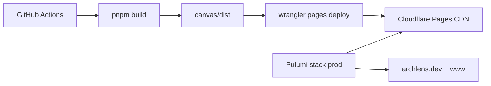

# Technology stack

Contributor reference: languages, frameworks, and infrastructure used to build, host, and ship ArchLens.

For module boundaries and hexagonal layout, see [Architecture & security](./architecture.md). For hosting decisions, see [ADR-0009: Cloudflare Pages](./ADRs/0009-cloudflare-pages-static-hosting.md).

---

## At a glance

| Layer                      | Choices                                                                                   |
| -------------------------- | ----------------------------------------------------------------------------------------- |
| **Canvas (web)**           | React 19, TypeScript, Vite, Tailwind CSS 4, Zustand, React Flow (`@xyflow/react`), Wouter |
| **Shared domain**          | `@archlens/core` — Zod schemas, parsers, merge rules, resilience simulation               |
| **CLI**                    | TypeScript, Bun compile → standalone `archlens` binary; ts-morph + tree-sitter            |
| **ChaosLens engine**       | Go → WebAssembly (`resilience-engine/`), loaded in the browser                            |
| **Persistence (browser)**  | IndexedDB (Dexie), File System Access API, service worker (PWA)                           |
| **Hosting**                | Cloudflare Pages + CDN; custom domain `archlens.dev`                                      |
| **Infrastructure as code** | Pulumi (TypeScript), `@pulumi/cloudflare`, stack state in Pulumi Cloud                    |
| **Deploy**                 | GitHub Actions → `pnpm build` → Wrangler `pages deploy`                                   |
| **Secrets**                | Bitwarden Secrets Manager (`bws`) locally; GitHub Actions secrets in CI                   |
| **Toolchain**              | Mise (`mise.toml`): Node, pnpm, Bun, Go                                                   |

---

## ArchLens Canvas

ArchLens Canvas is a **single-page app** served from `app/packages/canvas/`:

- **React 19** for UI; **Wouter** for client-side routing (`/`, `/guide/*`, `/workspace/*`, lens URLs).
- **Vite** for dev server, production bundle, and syncing repo assets into `public/` at build time:
  - `blueprints/` → `/bundled-blueprints/*` (sandbox demo workspace)
  - `schemas/` → `/schemas/*` (public JSON Schema for BlueprintSpec and ChaosSpec)
  - `docs/screenshots/` → `/docs-assets/*`
- **Tailwind CSS 4** (`@tailwindcss/vite`) for styling.
- **Zustand** store split into `uiState`, `diagramState`, `ioState`, and `resilienceState`.
- **React Flow** for the interactive C4 canvas; **dagre**, **ELK**, and **d3-hierarchy** for layout.
- **Mermaid** for import/export; **tree-sitter** WASM for syntax highlighting in the code viewer.
- **vite-plugin-pwa** + Workbox for offline shell caching and bundled-blueprint `CacheFirst` runtime rules.
- **Playwright** + axe for e2e and accessibility tests in CI.

Docs and the live product share one build — Markdown under `docs/` is imported at compile time and rendered in-app.

---

## Monorepo (`app/`)

| Package            | Role                                                                                           |
| ------------------ | ---------------------------------------------------------------------------------------------- |
| `@archlens/core`   | Pure domain: Zod contracts, YAML/Mermaid/Terraform parsers, workspace catalog, ChaosLens rules |
| `@archlens/canvas` | Canvas PWA, docs site, workspace adapters                                                      |
| `@archlens/cli`    | Static analysis CLI, blueprint writers, AdviceLens estate runner                               |

**pnpm** workspaces (`app/pnpm-workspace.yaml`). **Vitest** for unit tests; **oxlint** + **Prettier** for lint/format. **Knip** for unused-code checks in CI.

---

## ArchLens CLI

- Entry: `app/packages/cli/src/cli/archlens.ts`
- **Bun** compiles a standalone binary (`bun build --compile`) for macOS, Linux, and Windows in release CI.
- Parses TypeScript/JavaScript (ts-morph), HCL, and other languages via tree-sitter adapters.
- Writes `blueprints/*.yaml` using the same `@archlens/core` types ArchLens Canvas loads.

---

## ChaosLens engine

- **Go** simulation core in `resilience-engine/`, compiled to **WASM** for the browser.
- `make copy-wasm` copies `chaoslens.wasm` into ArchLens Canvas `public/` tree before `pnpm build`.
- TypeScript fallback paths exist in `@archlens/core` for tests; production canvas prefers WASM.

See [ChaosLens engine](./chaoslens-engine.md).

---

## Production hosting (Cloudflare)

| Piece             | Location / tool                                                           |
| ----------------- | ------------------------------------------------------------------------- |
| Pages project     | Pulumi `cloudflare.PagesProject` (`infra/cloudflare/`)                    |
| Custom domains    | Pulumi `cloudflare.PagesDomain` (apex + `www`)                            |
| Static upload     | `wrangler pages deploy` from `.github/workflows/ci.yml`                   |
| SPA routing       | `public/_redirects` (`/schemas/*` passthrough, `/*` → `index.html`)       |
| IaC workflow      | `.github/workflows/pulumi-cloudflare.yml` (preview on PR, `up` on `main`) |
| Bootstrap secrets | `bin/setup-cloudflare-hosting.sh` (bws → GitHub + Pulumi config)          |

Stack config with account/zone IDs and API tokens is **not** committed — see [cloudflare-secrets.md](./cloudflare-secrets.md) and `infra/cloudflare/Pulumi.prod.yaml.example`.

---

## CI/CD (GitHub Actions)

Canonical map of every workflow (purpose + triggers): [GitHub Actions workflows](./guide/ci-workflows.md).

`.github/workflows/ci.yml` on push/PR to `main`:

1. **quality** — format, lint, typecheck, schema check, knip, Go vet
2. **unit-tests** — Vitest coverage, Go tests
3. **e2e** — Playwright
4. **build** — production canvas + CLI artifacts
5. **deploy-cloudflare** — Wrangler upload to Pages (`main` only)

CLI releases are a separate job chain (`release-cli.sh`) when conventional commits warrant a tag. Catalog publish and `samples/` publish live in sibling workflows (see the map above).

---

## Secrets & local bootstrap

| Secret                  | Used for                                     |
| ----------------------- | -------------------------------------------- |
| `CLOUDFLARE_API_TOKEN`  | Wrangler deploy + Pulumi Cloudflare provider |
| `CLOUDFLARE_ACCOUNT_ID` | Wrangler + Pulumi                            |
| `CLOUDFLARE_ZONE_ID`    | Pulumi (DNS / zone lookup)                   |
| `PULUMI_ACCESS_TOKEN`   | Pulumi Cloud backend in CI                   |

Local maintainers use **Bitwarden Secrets Manager** (`bws run`) and `gh` to sync these — see [cloudflare-secrets.md](./cloudflare-secrets.md).

---

## Related docs

- [Setup & local development](./setup.md) — Mise, `pnpm dev`, builds
- [Architecture & security](./architecture.md) — hexagonal modules, validation
- [Cloudflare secrets checklist](./cloudflare-secrets.md) — bootstrap and cutover
- [infra/cloudflare/README.md](../infra/cloudflare/README.md) — Pulumi commands
- [Architecture Decision Records](./ADRs/README.md) — durable design choices
